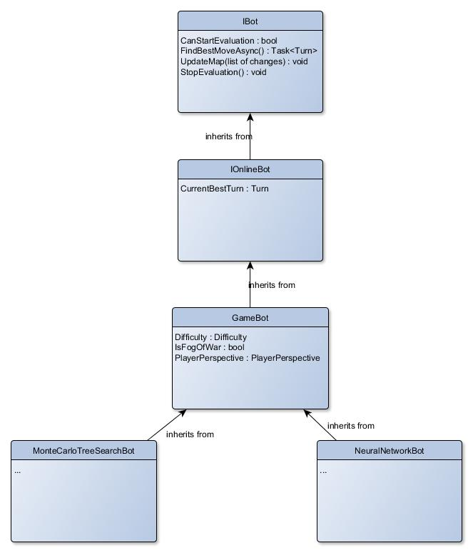
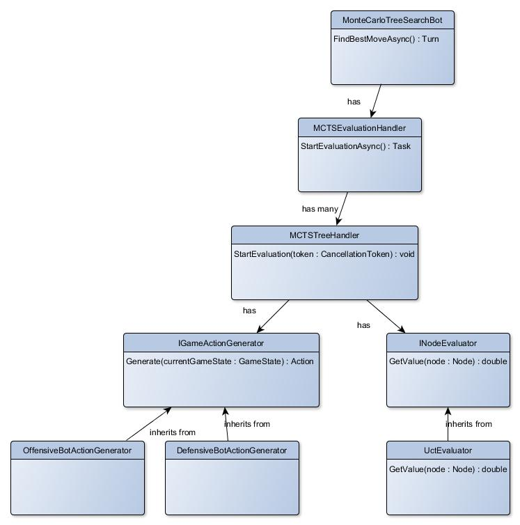

# Bot hierarchy

## Goal
The goal is to design a bot, that can paralelly asynchronously find the
best move for the next situation and can cancel the evaluation on users
demand at any time and return the best move.

## Approach


1. Can stop evaluation - the bot implements method *StopEvaluation()*
2. Can return best move at any given time - bot is online-bot, it will periodically
update its best move and property *CurrentBestMove* will return this move.
3. Can asynchronously and paralelly find best move - *FindBestMoveAsync()*

This design is flexible enough to fill up requirements. However, the problem is
to implement those features without hindering the evaluation speed.

## Design details
### Stop evaluation
Bot has to know if the stop condition has been fulfilled. Therefore there must be
stored this information. But how?

1. Boolean field *IsStopped* reporting whether the evaluation should stop
(and then reset it to continue evaluation again)
    - *problems*: situation when user wants to stop evaluation and soon after
    continue again, could end up ignoring the stop condition.
2. Field of type *CancellationTokenSource* and passing tokens from this source of type
*CancellationToken* in the method parameters - this solution would solve
fast stop/continue commands, because tokens relate to the source and if the source
is cancelled, it cannot be "uncancelled". Thus for continuing the evaluation
bot would create new *CancellationTokenSource* instance and get new tokens from this source.,
    - *problems*: passing tokens in parameter will slow the evaluation

Solution that was chosen was to have enum with 3 states:
```csharp
    /// <summary>
    /// Evaluation state of the bot.
    /// </summary>
    public enum BotEvaluationState
    {
        /// <summary>
        /// Bot is not running at the moment.
        /// </summary>
        NotRunning,
        /// <summary>
        /// Bot should stop.
        /// </summary>
        ShouldStop,
        /// <summary>
        /// Bot is running at the moment.
        /// </summary>
        Running
    }
```

This will ensure that new evaluation won't be started unless
the bot is in *NotRunning* state. When evaluation starts,
bot will check for *NotRunning* state, otherwise throw an exception, then
it will set *Running* on.

We don't want to throw exception and catch it every time someone
tries to start a new evaluation process when the cancellation
of the previous one was not handled.
Therefore *IBot* interface will have property *CanStartEvaluation*.

## Monte Carlo tree search bot
In this chapter Monte Carlo tree search
bot implementation for this game will
be discussed.

Further in this chapter there will
be used following terms:
- **Action** - sequence of moves of given player
- **Action generator** - component that generates
action (based on some game heuristics)
- **Board state** - state of the game

Each node of the tree describes the
current board state. Each edge in
the tree describes an action that led to
the child's described board state.

### Basic algorithm description
MCTS is best-first-search algorithm.
It has 4 main steps that run in a loop:
1. *Selection* - select the most appropriate
node that is not expanded
2. *Expansion* - expand the selected node meaning
choose next actions that will be
beginning for simulation part
3. *Simulation* - play (randomly in a sense)
actions and then evaluate the result of the game
4. *Backpropagation* - backpropagate
result obtained in simulation phase
back to the root

### Parallel MCTS
There are many approaches for implementing
MCTS in parallel. The approach that will be used
in this project is *Root parallelisation*.

*Root parallelisation* is easy parallel algorithm
achieving good results. It is described by following steps:

1. In parallel build separate trees,
do all evaluation separately
2. When the evaluation comes to an end (e.g. timer),
merge the trees and return the action (edge)
leading to a board state (node), that
was visited the most times (thus
achieved the best results).

### Design



- *MCTSTreeHandler* - handles evaluation
on one tree, each instance of this class
represents one single-threaded evaluation of
Monte Carlo tree search
- *IGameActionGenerator* - handles generating
actions (sequence of moves for a player). The
generation should be semi-random, meaning
it should randomly choose from meaningful actions.
- *INodeEvaluator* - handles evaluating node's
quality. It comes to use in selection phase of MCTS,
when we need to choose best unexpanded node.
- *MCTSEvaluationHandler* - handles parallel
evaluation using *MCTSTreeHandler*s.