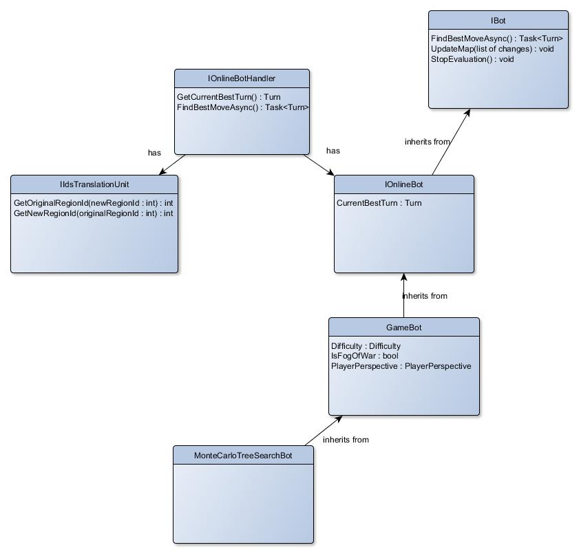

# Bot structures

## Design

### Description
- *IBot* - most abstracted bot interface
- *IOnlineBot* - while searching for the best move, it should periodically
update *CurrentBestTurn*. The reason for this is that if *StopEvaluation()* is called
prematurely, the current best result is stored anyway.
- *GameBot* - abstract class that provides Warlight-specific implementation details (fog of war,...)
- *MonteCarloTreeSearchBot* - provides implementation for *FindBestMoveAsync()* method.
There can be other classes inheriting from *GameBot* that will implement this method.
Each of those classes will represent one approach to the evaluation (others can be e.g. 
*MinimaxBot*, ...).
- *IOnlineBotHandler* - this interface connects *IOnlineBot* and *IIdsTranslationUnit*.
Only this part is visible to the application. Its purpose is to call correct methods
for translating and evaluating.
- *IIdsTranslationUnit* - our evaluation bot can use (and in our case indeed uses) special ID translating
e.g. if original regions IDs were 1, 2, 4, new region IDs would be 0, 1, 2 (for indexing
to array purposes). Due to this fact there has to be implemented translation for IDs, which
is purpose of this specific class.

## Flow
1. Application calls *FindBestMoveAsync()* on *IOnlineBotHandler*.
2. *IOnlineBotHandler* calls *FindBestMoveAsync()* on *IBot*.
3. *MonteCarloTreeSearchBot* (or other on the same level) provide implementation for the *FindBestMoveAsync()*,
which will be called. It starts searching.
4. After some time (or when evaluation ends) *IOnlineBotHandler* calls *StopEvaluation*.
This will result in breaking the evaluation. Because *IOnlineBot* periodically
saves best result to *CurrentBestMove* property
5. Application calls *GetCurrentBestTurn* to obtain the best move.

