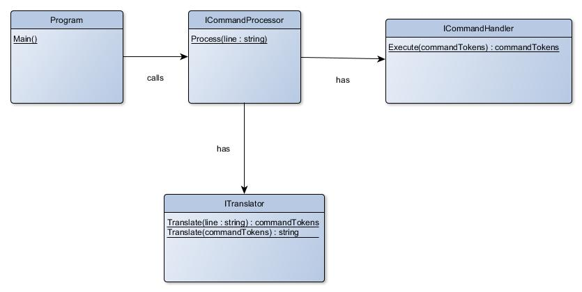

# Command processing

## Goal
Purpose of this design is to allow flexible translating of communications protocols.

## Definitions
*CommandToken* is a unit that represents certain kind of command, that the program will execute
(similar to token in programming compilers).

## Flow
1. *Program* calls *ICommandProcessor* with line containing some kind of commands
2. *ITranslator* translates these commands into *CommandToken*s. *CommandToken* is 
an object that this application understands and can work with it.
3. *ICommandProcessor* sends these translated tokens into *ICommandHandler*,
who executes them
4. *ICommandHandler* returns an answer in form of CommandTokens or reports that there
is no answer.
5. *ITranslator* translates answer from command tokens back to string *Program* 
understands.
