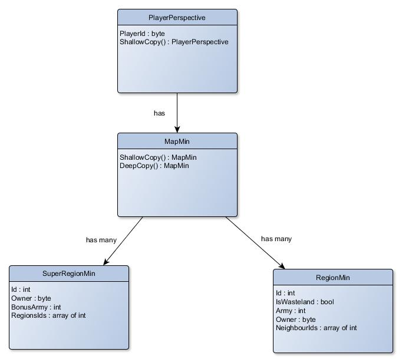

# Evaluation structures
## Goal
Main goal of evaluation structures is to allow evaluation of best-move
searching algorithm.

## Requirements
Suppose the algorithm is recursive. On each level we need to pass structure in the parameter
to the method that will specify current situation on the board. We need to ask a question:
Let's divide information into two categories: *dynamic* (those that we need to refresh
on each level of recursion because they can possibly change) and *static* (those we do not need to refresh).

*What exactly do we need to refresh on each level?*

**1. Player**
- *dynamic* - We need to change player perspective on the level. The point is to find best possible move on each
level for every player, so we need to have information about current player on the move.
- *static* - nothing

**2. Region**
- *dynamic* - army, owner, information whether the region is visible
- *static* - region ID, is wasteland boolean

**3. SuperRegion**
- *dynamic* - super region owner
- *static* - super region ID, bonus army

*Region* should also hold information about its neighbours and *SuperRegion* should
hold information about Regions, that are contained by it. I'm gonna analyze Region and its neighbours problem,
SuperRegion's problem is similar.

There are three possibilities:
1. Region could have reference to all its neighbours information.

	*Advantages*:
	- easy manipulation
	- fast traversing between neighbours

	*Disadvantages*:
	- slow copying, because we don't only need to copy the instance itself, we need
	to refresh each Region, such that it has as neighbour the mentioned instance

2. Region could have reference to its static neighbours information.

	*Advantages*:
	- fast copying, because we only need to copy it once

	*Disadvantages*:
	- not that good traversing and harder manipulation

3. Region could have list of IDs identifying its neighbours

	*Advantages*:
	- even slightly faster copying (than in 2.)

	*Disadvantages*:
	- harder manipulation and no traversing, e. g. to obtain any information of neighbour region
	we would need to
	1. Get that regions ID
	2. Get the Region structure from list of all Regions

		the second step could be potentially very long (it would have to be optimized, something like index
		to the array ~ ID)

- First option is not good, because copying is slow and that is the reason why we use special evaluation structures.
- Second option is not good as well, because there is no need to access static properties of the region.
Only useful one might be fast neighbour's neighbour access. This usually is not needed, because one can conquer
only neighbour region (with fog of war one can see only neighbour region).
- Third option is not good as well, because last thing mentioned about neighbours could actually be useful
at some point. Traversing structure this way would be very slow.

The second or third option are both viable choices. The second one seems to be more flexible, but
overall in the evaluation it could generate a lot of cache misses. I would in the end go for option
3.

## Representation
For structures copying to be faster, they will be implemented effectively. Thus *dynamic* part 
has to be as small as possible, because it will be copied on each level of recursion (*static* part will
be copied only as a pointer to the same non-changing structure). This will be reached by encoding
e.g. 8 booleans can be encoded into one byte, where each bit of byte will be corresponding boolean.

Instead of other collections, arrays will be used in order to ensure best speed possible.

Further details won't be specified here. Evaluation structures will be commented appropriately for 
programmer to understand specifics.

