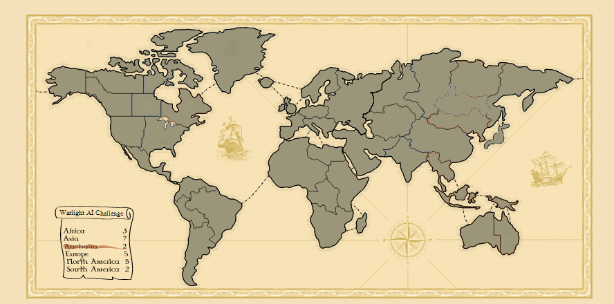
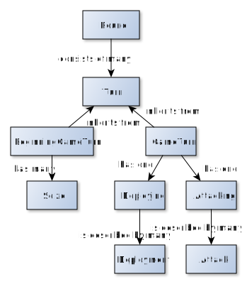
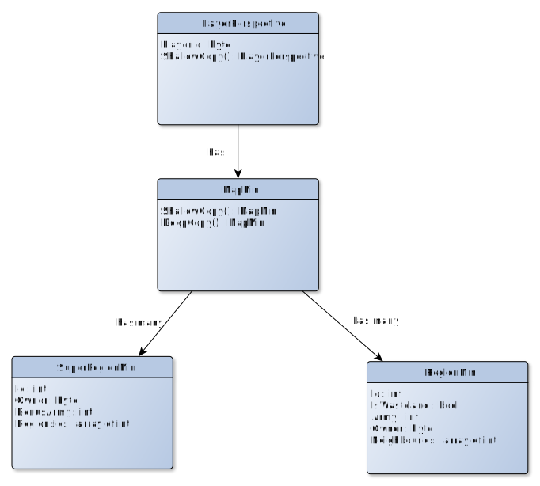

# Umìlá inteligence pro deskovou hru Warlight
## Abstrakt
Warlight, inspirovanı deskovou hrou Risk, pøedstavuje
vızvu pro tvorbu umìlé inteligence z dùvodu obrovského branching
faktoru.

Práce implementuje umìlou inteligenci do této hry schopnou hrát vyrovnanou hru
s alespoò ménì zkušenım hráèem. Souèástí je také simulátor, mo�nost
hry proti AI i proti jinému lidskému hráèi ve formì hotseat (multiplayer hry na jednom poèítaèi).
Práce je navr�ena tak, aby umo�nila pou�ití tohoto frameworku pro další vıvoj a testování umìlé inteligence.

## Úvod
<!---popis kontextu, kterého se práce tıká - popis hry, souvislost s riskem--->

### Základní informace o høe
Warlight, inspirovanı deskovou hrou Risk, je hra pro více hráèù zjednodušenì
simulující skuteènı váleènı konflikt. Ka�dı hráè zaèíná na 2 území. Cílem
hry je dobıt všechna území vlastnìné ostatními hráèi. Nedílnou souèástí této hry 
je také náhoda, která rozhoduje o mno�ství ztrát pøi ka�dém boji.

### Motivace
<!--- motivace k vytvoøení práce --->
I pøes existenci soutì�e vypsané Riddles.io je oblast tvorby umìlé inteligence pro hru Warlight nepøíliš zmapovaná.
Dùvodem je nezveøejòování existujících implementací, nebo jejich malá èi vùbec �ádná dokumentace.
Neprobádanost, spolu s velkım branching faktorem hry, nás motivuje k pokusu o vytvoøení umìlé inteligence,
která bude schopná hrát vyrovnanou hru alespoò s ménì zkušenım hráèem.

### Cíl práce
<!--- co specifiètìji je v mé práci, trošku jak --->
Cílem práce je naimplementovat umìlou inteligenci do hry Warlight.
Pro snadnìjší vıvoj umìlé inteligence je dílèím cílem práce pøidat simulátor
pro pozorování her botù proti sobì a hru ve formì singleplayer nebo hotseat
multiplayer hry (více hráèù na jednom poèítaèi).

### Related works
Práce [GG Warlight Strategy Guide.pdf] a [LearningWarlightStrategy.pdf] popisují,
jakımi pravidly by se mìl lidskı hráè øídit pøi hraní Warlightu. Poznatky z tìchto prací
jsou vyu�ity pøi tvorbì generátoru akcí pro AI.

Práce [MHuntersWarLightStrategyGuide.pdf] obsahuje sadu rad, jak by se umìlá inteligence mìla
chovat v rùznıch herních situacích. Ty jsou vyu�ity pøi implementaci generátoru akcí a funkcí ohodnocujících stav
v AI.

Práce [Parallelmcts.pdf] rozebírá pøístupy k implementaci algoritmu Monte Carlo tree search
paralelnì. Jejich efektivita je mìøena na høe Go. Prací zmínìná Koøenová paralelizace je pou�ita
pro paralelizování vıpoètu v naší implementaci umìlé inteligence.

### Struktura práce
Práce se skládá ze 4 kapitol vyjma úvodu:
- **Pravidla hry** - cílem první kapitoly je detailnì popsat ètenáøi pravidla hry
Warlight.
- **Umìlá inteligence** - ve druhé kapitole zanalyzujeme problém tvorby umìlé inteligence do hry Warlight a vybereme vhodnı algoritmus. Zamìøíme se na obecnì pou�itı algoritmus a jeho modifikace pøizpùsobené znalostem této hry.
Nakonec rozebereme vısledky hry naší umìlé inteligence proti lidskım hráèùm i jinım AI. Zamìøíme
se na prùzkum jejich nedostatkù a problémová místa.
- **Implementace** - tøetí kapitola popisuje soubory související s prací a strukturu a vıznam hlavních
implementovanıch tøíd.
- **Závìr** - závìreèná kapitola zhodnocuje celé dílo. Nakonec uvádí mo�né navázání na tuto práci.

## Obsah práce
1. [Pravidla hry]
2. [Umìlá inteligence]
3. [Implementace]
4. Závìr práce
5. [Seznam pou�ité literatury]

## Pravidla hry
Pravidla hry Warlight jsou relativnì volná, hra se dá hrát na spoustu rùznıch nastavení, která 
se liší pøedevším v míøe náhody pøi útoèení a zpùsobu volení regionù na zaèátku hry.
Cílem této kapitoly je popsat pravidla hry Warlight s nastavením implementovanım v této práci.

### Mapa
Hra se odehrává na mapì. Ta se dìlí na *regiony*, nejmenší územní celky této hry.
Ka�dı region má armádu, seznam sousedních regionù, a buï hráèe, kterı ho vlastní, nebo je neobsazenı.
Regiony se dále shlukují do vìtších územních celkù, *super regionù*.
Mapou mù�e bıt libovolnı neorientovanı graf regionù.

V práci je naimplementována jediná mapa slou�ící pro úèely testování a hraní - mapa svìta.


Regiony této mapy jsou ohranièená území na obrázku, Super regiony jsou kontinenty - Afrika, Asie, Austrálie, Evropa, Severní a Ji�ní Amerika.

### Zaèátek hry
Na zaèátku hry je pro ka�dého hráèe vygenerována mno�ina regionù tak, �e od ka�dého super regionu jsou zvoleny právì 2.
Hráè si z této mno�iny vybírá 2 regiony. Tato území pøedstavují vıchozí body, ze kterıch bude obsazovat další.
Commitem potvrzuje své pøedchozí akce.

### Prùbìh hry
Hra se dìlí na herní kola. Ka�dé z nich
se skládá z tahù, kde ka�dı hráè pøispívá do kola právì jedním tahem.

Bìhem hry se hráèi se støídají po tazích. Odehrají-li všichni hráèi své tahy,
dojde k ukonèení kola. Poté dojde k vıpoètu nového stavu hry, tedy vıpoètu ztrát jednotek a 
pøípadnıch zmìn vlastníkù regionù a k zapoèetí nového kola. Tyto kroky se opakují,
dokud jeden hráè neobsadí regiony všech ostatních hráèù, a nevyhraje tak hru.

### Tah
Tah se dìlí na 3 fáze: deploy, attack a commit.
V deploy fázi hráè staví armádu, v attack fázi posílá útoky a v commit fázi potvrzuje své pøedchozí akce.

Pøechody mezi tìmito fázemi se øídí následujícím schématem:


Po odehrávání deploy fáze hráè pøechází do attack fáze, po jejím� odehrání pøechází do commit fáze.
Svùj tah poté hráè dokonèuje potvrzením svıch pøedchozích akcí v comit fázi.

V deploy, attack i commit fázi má hráè mo�nost své zmìny vrátit. Mezi fázemi lze tak procházet
i opaènım smìrem. Pøejde-li však hráè z napøíklad attack fáze do deploy fáze, zruší tím veškeré attack akce,
které v této fázi zadal. Podobnì hráè mù�e pøejít z commit fáze do deploy fáze, nebo v deploy fázi zrušit
své veškeré zadané deploy akce.

#### Deploy fáze
V této fázi hráè staví armádu na ním vlastnìné regiony.

*Deploy akcí* nazveme jev, kdy hráè postaví nenulovı poèet jednotek na danı region.
Deploy fáze se skládá z 0 nebo více deploy akcí. Pokud v jedné deploy fázi je více deploy akcí stavìjící jednotky na stejnı region,
tyto akce jsou slouèeny - více deploy akcí se nahradí
jednou, která postaví souèet všech jednotek postavenıch deploy akcemi na danı region.

Hráè má urèenı maximální poèet jednotek, které mù�e v daném tahu postavit.
Na zaèátku hry mù�e stavìt 5 jednotek. Dobude-li nìjakı super region,
zvıší se mu pøísun jednotek o bonus definovanı super regionem. Pokud o super region pøijde,
pøijde také o bonus jím poskytovanı.

Super regiony mapy svìta mají následující bonusy:
- Asie - 7
- Evropa - 5
- Severní Amerika - 5
- Ji�ní Amerika - 2
- Afrika - 3
- Austrálie - 2

#### Attack fáze
V této fázi hráè útoèí armádou v�dy ze svého regionu na region sousední,
popøípadì jednotky pøesouvá mezi svımi sousedními regiony.

*Attack akcí* nazveme jev, kdy hráè pošle nenulovı poèet jednotek z jím vlastnìného regionu
na region sousední. Attack fáze se skládá z 0 nebo více attack akcí. Pokud v jedné attack fázi je více attack akcí takovıch,
�e útok vychází ze stejnıch regionù a míøí do stejnıch regionù, pak jsou tyto akce slouèeny - z více se vytvoøí jedna
attack akce, která bude ze stejnıch regionù a míøit do stejnıch regionù a armáda bude souèet všech vyslanıch jednotek pro dyné dva regiony.

Pøi útoku nelze útoèit s celou armádou. Na regionu zùstat alespoò jedna jednotka.

#### Commit fáze
V této fázi hráè potvrzuje akce, které provedl v deploy a attack fázi.
Po tomto potvrzení ji� není mo�né je vrátit a hráèùv tah je pova�ován za uzavøenı.

### Kolo
Ka�dı hráè pøispívá do kola právì jedním tahem. Jakmile všichni ukonèí své tahy commitem, spustí se vıpoèet kola, kterı aktualizuje herní
stav.

Tahy posledního kola se nejprve zlinearizují, poté následuje vıpoèet zmìn.

#### Linearizace
Linearizace je algoritmus, kterı zjednoduší vnoøenou strukturu tahù. Z kola
vytvoøí linearizované kolo. To má stejnou strukturu jako tah a
obsahuje všechny deploy a attack akce tahù daného kola, ale ve zmìneném poøadí.


Algoritmus nejprve zlinearizuje deploy akce tak, �e pro ka�dı index *i = 1, ..., maximum(poèet deploy akcí libovolného tahu)* vezme i-té deploy
akce všech tahù daného kola (v libovolném poøadí) a pøidá je do vıstupního seznamu.
Poté zlinearizuje attack akce tak, �e pro ka�dı index *i = 1, ..., maximum(poèet attack akcí libovolného tahu)* vezme i-té attack akce
ka�dého tahu, a v náhodném poøadí je pøidá do vıstupního seznamu.
Linearizované kolo je tvoøeno dvìma vıše popsanımi vıstupními seznamy.

**Pseudokód**
```
Linearizuj() : kolo
    tahy = { všechny t | t je odehranı tah }
    zpøeházejNáhodnì(tahy);

    // zlinearizuj deploy akce
    deploy = {}
    pro ka�dı index i = 1, ..., maximum(poèet deploy akcí libovolného tahu)
        iDeploy := { i-té deploy akce všech tahù }
        deploy.pøidej(iDeploy)

    // zlinearizuj attack akce
    attack = {}
    pro ka�dı index i = 1, ..., maximum(poèet attack akcí libovolného tahu)
        iAttack := { i-té attack akce všech tahù }
        zpøeházejNáhodnì(iAttack)
        deploy.pøidej(iAttack)

    linearizovanéKolo = (deploy, attack)
    vra� linearizovanéKolo

```

#### Vıpoèet zmìn kola
Pøi vıpoètu zmìn kola dojde k aktualizaci herního stavu provedením všech zlinearizovanıch akcí.

Nejprve jsou spuštìny všechny deploy akce - jednotky jsou pøidány na hráèi regiony.

Poté jsou spuštìny všechny attack akce - dojde k vıpoètu ztrát jednotek v boji a pøípadné zmìnì vlastníkù regionù.
Vıpoèet ztrát se øídí následujícími pravidly:
- Ka�dá útoèící jednotka má 60% šanci na zabití bránící jednotky.
- Ka�dá bránící jednotka má 70% šanci na zabití útoèící jednotky.

Následující algoritmus spoèítá všechny zmìny zpùsobené útoky a zaktualizuje tak
souèasnı herní stav.
Algoritmus implementuje následující pravidla:
- pokud útoèící region zmìnil vlastníka, tento útok se neprovede (byl by proveden jednotkami hráèe, kterı útok neposlal)
- nelze zaútoèit tak, �e na regionu nezùstane �ádná jednotka - v�dy musí zùstat alespoò 1
- útoèí-li hráè na svùj region, nedochází ke ztrátám na jednotkách
- pokud pøi útoku dojde k zabití útoèících i bránících jednotek, na bránící region je pøiøazena 1 jednotka (a nemìní se jeho majitel)
- pokud pøi útoku jsou zabity všechny bránící, ale nìjaká útoèící jednotka pøe�ila, novım vlastníkem regionu je útoèící hráè a zbytek
útoèících jednotek se pøesune na dobytı region
- pokud pøi útoku pøe�ily bránící i útoèící jednotky, zbytek pøe�ivších útoèících jednotek se vrátí na region, ze kterého pøišly

**Pseudokód**
```
spoèítejAttacky(linearizovanéAttacky)
    pro ka�dı attack v linearizovanéAttacky
        X := attack.útoèícíRegion
        Y := attack.bránícíRegion
        útoèícíHráè := attack.útoèícíHráè;

        // útoèící region zmìnil vlastníka
        pokud X.vlastník != útoèícíHráè
            pøeskoè tento útok

        // v�dy musí zbıt alespoò jedna jednotka na regionu
        reálnáÚtoèícíArmáda := minimum(attack.útoèícíArmáda, X.armáda - 1)
        bránícíArmáda := Y.armáda

        // hráè útoèí na svùj region
        pokud útoèícíHráè == Y.vlastník
            pøesuò jednotky
        jinak
            // spoèítej zabité jednotky
            zabitéÚtoèícíJednotky :=
                spoèítejZabitéÚtoèícíJednotky(reálnáÚtoèícíArmáda, bránícíArmáda)
            zabitéBránícíJednotky :=
                spoèítejZabitéBránícíJednotky(bránícíArmáda, reálnáÚtoèícíArmáda)
            
            pokud byly zabity všechny útoèící i bránící jednotky
                bránícíArmáda := 1
            jinak pokud byly zabity všechny bránící, ale útoèící ne
                Y.vlastník := útoèícíHráè
            jinak pokud pøe�ily i bránící i útoèící
                vra� se s pøe�ivšími útoèícími jednotkami zpìt na X
            jinak pokud pøe�ily bránící
                // nic nedìlej
        
```

## Umìlá inteligence
<!--- popis kapitoly --->
V této kapitole nejprve zanalyzujeme problematiku tvorby umìlé inteligence do hry Warlight a
urèíme vhodnı pøístup k implementaci AI. Následnì
uká�eme naši implementaci a popíšeme vytvoøenou referenèní AI.
Na závìr otestujeme schopnosti naší AI a zanalyzujeme vısledky testování.

### Analıza
Cílem této sekce je prozkoumat problémy implementace umìlé inteligence do hry Warlight.

#### Vıpoèetní nároènost
Hra Warlight je vıpoèetnì velmi nároèná. Tah se skládá z deploy a attack akcí.
Na poøadí deploy akcí jednotlivıch tahù nezále�í, poøadí attack akcí však doká�e znatelnì
ovlivnit prùbìh kola. Jednotky lze nepøebernì zpùsoby distribuovat na vlastnìné regiony,
a ještì více zpùsoby je lze posílat na regiony sousední.

Vezmeme-li si napøíklad zjednodušenou herní situaci:
Hráè vlastní 2 nesousedící regiony a ka�dı z nich má 3 sousedy.
Je-li *n* je poèet jednotek na jednom z jeho regionù, pak mù�e zaútoèit následujícím poètem zpùsobù:

*(i + 3)! / (i! * 3!)*

Vıše uvedenı vzorec urèí, kolika zpùsoby lze rozdìlit *i* jednotek do 2 skupin - na bránící a útoèící.
Pro *n = 6*, co� odpovídá situaci, kdy jeden region má 7 jednotek (z toho 6 lze poslat),
bude vısledná hodnota 56.

Vezmeme-li v úvahu, �e hra má dva hráèe a protivník má stejnı poèet mo�ností,
jak zaútoèit, budeme mít branching faktor *56 * 56 = 3136*. Je zøejmé, �e všechny
tyto mo�nosti nemù�eme prozkoumat a bude potøeba stavovı prostor zmenšit.

#### Náhoda pøi boji
<!--- nedeterminismus útoku --->
Další vızvou je nedeterminismus útoku. Náhoda pøi vıpoètu
útoku mù�e znatelnì ovlivnit novı stav po skonèení kola. Jak ji�
bylo øeèeno v sekci pravidla, ka�dá útoèící jednotka má v boji 60% šanci
na zabití bránící jednotky a ka�dá bránící jednotka má 70% šanci na zabití jednotky útoèící.

Aèkoliv je bránìní zdánlivì vıhodnìjší, podle [najdu tu práci a pøidám referenci] je strategicky vıhodnìjší pøistupovat
ke høe agresivnìji.

#### Volba algoritmu umìlé inteligence
Èasová doba vıpoètu je znaènì omezená. Algoritmus by mìl bıt schopen bìhem nìkolika sekund
najít nejlepší odpovìï.

<!--- volba algoritmu --->
Pro naši práci byl zvolen *Monte Carlo tree search*. Tento algoritmus je best-first search, tedy prozkoumává nejprve
odpovìdi, které se zdají bıt nejlepší. Vıhodou tohoto pøístupu je, �e 
po urèitém èase je schopen vrátit nejlepší dosud nalezenı tah. Díky této vlastnosti
také doká�e dobøe pracovat v obrovském stavovém prostoru, právì proto, �e se soustøedí
nejprve na nejkvalitnìjší pokraèování.

### Monte Carlo tree search AI
V této sekci nejprve popíšeme obecnı algoritmus Monte Carlo tree search,
následnì uká�eme jeho úpravy pro hru Warlight. Pro
zvıšení vıkonu je prozkoumán a zvolen jeden z pøístupù
k paralelizaci tohoto algoritmu. V úvahu jsou brány pouze hry 1v1,
rozbory hry více ne� 2 hráèù tato AI nepodporuje.

**Terminologie**
- *náš hráè* - hráè z jeho� pohledu se sna�íme najít nejlepší tah
- *nepøátelskı hráè* - hráè, kterı není náš hráè

#### Úvod do Monte Carlo tree search
Monte Carlo tree search (neboli MCTS) je algoritmus, jeho� cílem je
najít nejlepší tah pro danı stav hry. Pro tento úèel
je stavìn vıpoèetní strom. Jeho vrcholy pøedstavují
stavy hry, hrany pøedstavují akce, které do nich vedou.
Ve vrcholu je navíc ulo�en poèet vıher a poèet her stavu hry ve vrcholu.
V koøeni je ulo�en stav hry, ze kterého se pokoušíme nalézt
nejlepší tah.
Nejlepší odpovìï v�dy reprezentuje ta hrana, která vede do vrcholu s nejvyšším poètem her.
Tedy nejlepší odpovìï pro pozici, kterou prozkoumáváme, je hrana vedoucí z koøenedo vrcholu s nejvyšším
poètem her.

Algoritmus popisují 4 fáze, které jsou opakovány a� do pøerušení vıpoètu:
selekce, expanze, simulace a zpìtná propagace.


##### Selekce
Úlohou selekce je najít list stromu, kterı bude algoritmus dále rozvíjet.

**Pseudokód**
```
selekcePotomka() : vrchol
    vrchol := koøen;
    dokud vrchol != list opakuj
        vrchol := zvolVhodnéhoPotomka(vrchol.potomci);
    vra� vrchol;
```

Aèkoliv hlavní myšlenkou algoritmu je rozvíjet tahy, které se jeví bıt nejlepšími,
je potøeba také rozvíjet málo prozkoumané tahy. Kdyby tak algoritmus neèinil,
mohl by vynechat tah, kterı se zprvu jevil jako špatnı,
ve vısledku by ale byl nejlepším tahem v dané pozici.

[Kocsis a Csaba] navrhli *UCT* (Upper Confidence Bound 1 applied to trees) funkci:

*wi / ni + c * sqrt(ln(Ni) / ni)*, kde

- wi - poèet vıher v daném vrcholu
- ni - poèet her v daném vrcholu
- Ni - celkovı poèet her (= poèet her v koøeni)
- c - konstanta, teoreticky rovná *sqrt(2)*, standardnì volená empiricky

Pokud *ni* je rovno 0, pak hodnota tohoto vrcholu je *infinity*.
Tato situace nastává u expandovaného vrcholu, ze kterého ještì nebyla vedena simulace.
Hodnota *infinity* tak v pøíští selekci upøednostní tento vrchol pøed jinımi.

##### Expanze
Úèelem expanze je pøidat stavy (nebo stav), které se budou dále prozkoumávat a vybrat jeden z nich,
kterı se bude rozvíjet ve fázi Simulace.

**Pseudokód**
```
expanduj(list)
    pøidejPotomky(list);

    // vra� prvního potomka
    vra� list[1];
```

##### Simulace
Cílem simulace je ohodnotit expanzí vybranı vrchol. Simulace odehrává
tahy a� do stavu, kdy jedna ze stran vyhrála.

Existují 2 typy simulace: lehká a tì�ká.

Hlavní myšlenkou *lehké simulace* (light playout) je, �e odehraji-li náhodnì dostateènı poèet her, ze kterıch v�dy získám vısledek vıhra / prohra,
doká�u takovımto zpùsobem ohodnotit kvalitu tahu, ze kterého jsem náhodná odehrání vedl.
Vıhodou je, �e pro aplikaci lehké simulace není potøeba znát �ádné detaily hry - staèí pouze vìdìt ve vhodnı okam�ik, 
která strana vyhrála.
Tento pøístup se však nehodí pro hry s velkım branching faktorem, proto�e na odehrání
dostateèného mno�ství simulací, které by mìly vypovídající hodnotu, není dostatek èasu.

*Tì�ká simulace* (heavy playout) se namísto náhodného odehrávání sna�í volit tahy,
které se vyplatí prozkoumávat. Díky tomu má vısledek takové simulace mnohem vìtší váhu. Definovat takovı tah je ale
obtí�né, nalézt ho je vıpoèetnì nároèné a vy�aduje dobrou znalost hry. Tento typ simulace má [podle nìkoho] lepší
vısledky u hrách s vysokım branching faktorem.

##### Zpìtná propagace
Zpìtná propagace propaguje vısledek simulace od simulovaného vrcholu a� do koøene.

#### Úpravy MCTS
Základní forma MCTS je pro Warlight stále nepou�itelná.
V této sekci jsou popsány úpravy algoritmu tak,
aby efektivnì nacházel nejlepší tah v prostøedí této hry.

##### Vıpoèetní strom
Ve høe Warlight nejprve všichni hráèi odehrají své tahy a
a� poté dojde k vıpoètu kola. Jak by mìl tedy vypadat vıpoèetní strom?

<!--- vlastník vrcholu --->
Hrana bude reprezentovat tah hráèe.
U ka�dého vrcholu urèíme navíc jeho vlastníka. To bude
hráè, kterı odehrál tah vedoucí do tohoto vrcholu.
Vlastníkem koøene a jeho dìtí bude náš hráè.
Od následujících úrovní stromu se bude vlastnictví
v�dy støídat zaèínaje od nepøítele.

<!--- stav mapy v ka�dém sudém vrcholu --->
Stav mapy staèí mít ulo�enı v koøeni a ve vrcholech vlastnìnıch nepøítelem, proto�e
jeho tah je posledním tahem kola.

<!--- expanze v�dy po dvou --->
Ve høe Warlight v�dy dochází k odehrání kola a� po odehrání tahù všech hráèù.
Expanze proto nejprve listu zvolenému selekcí pøidá vrcholy urèené tahy
našeho hráèe, a tìm rovnou pøidá jako potomky vrcholy urèené tahy hráèe nepøátelského.


Na obrázku jsou vrcholy našeho hráèe reprezentovány �lutou barvou, vrcholy
nepøátelského hráèe modrou. Stav hry mají v sobì ulo�ené pouze modré vrcholy a koøen.
Èísla *m/n* napsaná na vrchol pøedstavují *poèet vıher / poèet her* daného vrcholu.
Modré vrcholy s poètem her 0 jsou vrcholy, z nich� nebyla dosud vedena simulace.

##### Simulace
Jak bylo uvedeno v analıze, obtí�nost hry Warlight spoèívá zejména ve vysokém branching faktoru.
Kvùli nìmu je nevhodné pou�ít náhodnou simulaci. Vıhodnìjší je zvolit simulaci tì�kou,
její� vısledek bude více odpovídat skuteèné kvalitì pozice.

Kvùli velké hloubce vıpoèetního stromu však nelze dokonce ani dohrát simulaci do konce. Taková
simulace by v lepším pøípadì stála mnoho èasu a v horším pøípadì vùbec neskonèila. Øešením je odsimulovat
pøedem urèenı poèet tahù a ohodnotit vıslednou pozici. Toto hodnocení bude v intervalu [0, 1], kde 1 bude vıhra
našeho hráèe a 0 vıhra soupeøe.

Pro získání pøedstavy o kvalitì pozice je potøeba bıt schopen tuto pozici ohodnotit.
V následující sekci podrobnì probereme funkci, která tento problém øeší.

###### Ohodnocovací funkce
Cílem ohodnocovací funkce je získat co nejlepší pøedstavu o kvalitì pozice z pohledu
libovolného hráèe.

Naše ohodnocovací funkce nejprve ohodnotí pozici ka�dého hráèe tak,
�e seète hodnotu všech jeho regionù a jejich armád.

**Pseudokód**
```
ohodno�PoziciHráèe(hráè) : hodnota
    hodnoceníPoziceHráèe := 0;
    pro ka�dı region takovı, �e hráè ho vlastní
        hodnoceníPoziceHráèe += ohodno�Region(region) + c * region.Armáda;

    vra� hodnoceníPoziceHráèe;
        
```
, kde *c* je reálná konstanta.

Tuto hodnotu poté normalizuje do intervalu (0, 1) jednoduchou formulí:

*normalizovanéOhodnoceníHráèe1 = hodnotaPoziceHráèe1 / (hodnotaPoziceHráèe1 + hodnotaPoziceHráèe2)*

Pro úplnost zbıvá ji� jen ohodnotit region.

###### Ohodnocení regionu
Ohodnocení regionu se musí lišit pro zaèátek hry, kde jsou vybírány poèáteèní regiony,
a zbylé èásti hry. Dùvodem k tomu je fakt, �e se tyto dvì èásti velmi liší.

Pøi zaèátku hry:

- není dobré brát více regionù blízko vedle sebe
- hodnota super regionu pøidává na hodnotì regionu

**Pseudokód ohodnocovací funkce regionu pøi zaèátku hry**
```
ohodno�RegionPøizaèátku(region, mùjHráè) : èíslo
    hodnota := 0;
    hodnota += a * získejHodnotuSuperRegionuPøiZaèátkuHry(region.SuperRegion);

    pokud jsem ji� zvolil nìjakı region
        mojeRegiony := mùjHráè.MojeRegiony;
        minimálníVzdálenostKMémuRegionu := Min(mojeRegiony, region);

        hodnota += b * min(minimálníVzdálenostKMémuRegionu, maximálníVzdálenostDvouRegionùNaMapì / 2);

    vra� hodnota;
```
, kde *a* a *b* jsou reálné konstanty.

Po zapoèetí hry:

- hodnota super regionu pøidává na hodnotì regionu
- vıhodnìjší je u super regionu je vlastnit co nejvíce regionù, nejlépe celı super region
- region, kterı patøí nìjakému hráèi, má vìtší hodnotu - upøednostnìní útoèení na nepøítele a
bránìní vlastních regionù

**Pseudokód ohodnocovací funkce regionu po zapoèetí hry**
```
ohodno�Region(region, mùjHráè) : èíslo
    hodnota := 0;
    // pøipoèti hodnotu super regionu
    hodnota += a * získejHodnotuSuperRegionu(region.SuperRegion);
    
    // pøidej bonus za poèet regionù pro mého hráèe
    hodnota := b * získejPoèetRegionùSuperRegionu(mùjHráè, region.SuperRegion);

    // region patøí nepøíteli => pøipoèti bonus za to, �e patøí nepøíteli
    pokud region.Vlastník je soupeø
        hodnota := b * získejPoèetRegionùSuperRegionu(nepøítel, region.SuperRegion);

    // pokud patøí mì nebo soupeøi, zdvojnásob hodnotu regionu
    pokud region.Vlastník jsem já nebo soupeø
        hodnota *= 2;

    vra� hodnota;
        
```
, kde *a* a *b* jsou reálné konstanty.

Pro ohodnocení regionu je však stále potøeba ohodnotit super region.
Ohodnocení super regionu, obdobnì jako ohodnocení regionu, se liší pøi zaèátku hry, a pozdìji.

Pøi zaèátku hry víme, �e:

- je vıhodné brát super region, kterı má málo sousedících regionù,
proto�e po dobytí se bude lépe bránit
- lepší je super region s více sousedními super regiony, proto�e mù�eme
narušovat bonusy nepøátelùm nebo rychle dobıvat další super regiony
- je lepší, kdy� super region má vyšší bonus
- je nevıhodné brát super region, kterı se skládá z hodnì regionù,
proto�e ho je tì�ké dobıt a trvá to dlouho

Tyto znalosti jsou poskládány do vzorce ohodnocovací funkce pro super region:

```
hodnotaSuperRegionu := a * bonus + b * sousedníSuperRegiony - c * sousedníRegiony - d * regionySuperRegionu
```

kde a, b, c, d jsou reálné konstanty.

V pozdìjších fázích hry se ohodnocovací funkce liší pouze v hodnotách konstant.

##### Generátory akcí
<!--- motivace --->
Jak ji� bylo zmínìno v analıze, poèet mo�nıch pokraèování v témìø libovolném stavu hry je pøíliš velkı.
Algoritmus nemá dostatek èasu na procházení všech mo�ností.
Potøebujeme zmenšit stavovı prostor.

<!--- popsat, co je generátor akcí a co dìlá --->
Klíèem k tomu je *generátor akcí*. To je komponenta,
jejím� úèelem je nalézt mno�inu smysluplnıch tahù pro daného hráèe.

<!-- popsat, jak funguje pøesnì --->
Náš akèní generátor nejprve vygeneruje deploy fáze, a pro ka�dou z nich
poté vygeneruje attack fáze. Vısledkem je kartézskı souèin deploy a attack fází, ve kterém
jsou posléze odstranìny duplikáty.
Algoritmus tak místo generování náhodnıch permutací akcí v tahu pou�ívá nìkolik potenciálnì dobrıch pokraèování,
které vzájemnì permutuje a znatelnì tak zmenšuje stavovı prostor. 

**Pseudokód**
```
vygenerujTahy(stavHry) : tahy
    tahy := {}
    
    // vygeneruje mo�nosti, jak udìlat deploy
    deploySekvence := vygenerujDeploy(stavHry)

    pro ka�dou deploy z deploySekvence
        // pøehrej deploy sekvenci akcí
        aktualizovanıStav := pøehrejDeploy(stavHry, deploy)
    
        // vygeneruj mo�nosti jak zaútoèit pro danı deploy
        útoky := vygenerujMo�nostiÚtoku(aktualizovnıStav)

        // pøidej všechny kombinace deploy a útokù do tahù
        pro ka�dı útok z útoky
            tahy.pøidej(deploy, útok)

    odstraòDuplikáty(tahy)
    vra� tahy
```

Generování deploy akcí vyu�ívá 3 pøístupy: útoènı, obrannı a expanzivní.

1. *Útoènı* - postaví jednotky na region sousedící
s neobsazenım nebo nepøátelskım regionem,
kterı je nejcennìjší (má nejvyšší hodnotu podle ohodnocovací funkce).

2. *Obrannı* - postaví jednotky na nejcennìjší regiony takové,
kterım hrozí dobytí nepøítelem.

3. *Expanzivní* - postaví jednotky na region sousedící
s nejcennìjším neobsazenım regionem.

<!--- zále�í na poøadí --->
Pøi útoèení, narozdíl od stavìní jednotek, zále�í na poøadí.
Napøíklad máme-li pozici, kde X je mùj region s armádou 8
a Y je s armádou také 8, je rozdíl, zdali X zaútoèí první na
Y nebo naopak, proto�e obránce má vıhodu.

<!--- pøesouvání jednotek z vnitrozemí k okraji --->
Jednotky na našem regionu, kterı má
za sousedy také pouze naše regiony, jsou nevyu�ité.
Vyplatí se je pøesouvat k místùm, kde se budou moci
zapojit do útoku nebo obrany. Následující pseudokód tuto funkcionalitu
implementuje.

**Pseudokód**
```
pøesuòArmádyZVnitrozemí(stavHry)
    pøesuny := {}
    pro ka�dı mùj region
        pokud všichni sousedi regionu jsou moje regiony
            // najdi nejbli�ší region, co není mùj
            cizíRegion := najdiCizíRegion(region)

            // najdi cestu k nìmu
            cesta := najdiNejkratšíCestuMezi(region, cizíRegion)

            // najdi první region na této cestì
            prvníRegionNaCestì := cesta[1]

            pøesun := pošliJednotky(region, prvníRegionNaCestì)

            pøesuny.pøidej(pøesun)
```

Pøi generování attack akcí pou�íváme 3 pøístupy TODO:
útoènou, útoènou s vyèkáním, obrannou.

1. *Útoèná* - z ka�dého regionu se v�dy podíváme na
nepøátelské sousední regiony, a potom na nì zaèneme posílat
útoky, dokud naše útoèící armáda je silnìjší ne� armáda bránící.

2. *Útoèná s vyèkáním* - nejprve provedeme pøesun jednotek
z vnitrozemí, poté útoèíme stejnì, jako v pøípadì útoèné varianty.
To, zaútoèí-li na nás nepøítel, nám zajistí vıhodu bránícího v boji.

3. *Obranná* - nejprve pøesuneme jednotky, poté zaèneme posílat útoky.
Ty provádíme ale tak, �e na region zaútoèíme jen s armádou, která
porazí tu nepøátelskou i v pøípadì, �e by na nìj nepøátelskı hráè postavil všechny jednotky,
které mù�e.

Díky vıše uvedenım algoritmùm se nám branching faktor znaènì zmenšil.
Z pùvodního branching faktoru *56 * 56* dojde ke zmenšení na *9 * 9**,
kde èíslo 9 reprezentuje všechny kombinace deploy a attack akcí.
Z pravidla je vìtvení mnohem menší, proto�e generování deploy a attack
akcí vygeneruje neunikátní tahy, ve kterıch jsou duplikáty odstranìny.

#### Paralelní MCTS
I pøes znatelné zmenšení branching faktoru je stavovı prostor hry stále
velkı. Pro vyšší vıkon by bylo vhodné paralelizovat vıpoèet pøi hledání tahu. 
V této sekci prozkoumáme mo�nosti paralelizace algoritmu MCTS a 
zvolíme metodu pøístupu k paralelizaci.

Existují 4 druhy paralelizace: listová, koøenová, stromová s globálním zámkem
a stromová s lokálními zámky.


1. *Listová paralelizace* - z expandovaného vrcholu je vedeno, místo jedné simulace,
simulací nìkolik. Tento postup je velmi jednoduchı na implementaci, avšak má
pro nás jeden dùle�itı problém (podle [1]) - rozehrajeme-li napøíklad 8 simulací, kde 7
skonèí prohrou, pak vıpoèetní èas strávenı na 8. z nich byl ztracenı, nebo� po 7 prohrách
jsme mohli usoudit, �e to nemá cenu dále zkoušet.

2. *Koøenová paralelizace* - místo stavìní jednoho vıpoèetního stromu jich stavíme rovnou nìkolik.
Tyto stromy jsou na sobì zcela nezávislé. Kdy� vyprší èas a algoritmus má vrátit nejlepší nalezenı tah,
dìti koøenù ve všech stromech jsou sjednoceny - jsou-li dva vrcholy stejné, seète se jejich poèet vıher a poèet her
a slijou se do jednoho, a v tìchto sjednocenıch vrcholech se vezme vrchol s nejvyšším poètem návštìv algoritmu.
Tato paralelizace je opìt velmi jednoduchá.

3. *Stromová paralelizace s globálním zámkem* - na strom je umístìn zámek, kterı zaká�e pøístup
ke stromu více ne� jednomu vláknu. Simulace však mù�ou probíhat paralelnì, ostatní fáze MCTS však ne.

4. *Stromová paralelizace s lokálními zámky* - stromová paralelizace s lokálními zámky umo�òuje pøístup 
ke stromu více vláknùm. Kdykoliv vlákno pøistoupí k vrcholu stromu, zamkne si ho, jakmile ho opustí, odemkne ho.
Budou-li pou�ity jako zámky spinlocky, proto�e zamykání bude pouze na krátkou chvíli, tento pøístup by mìl bıt efektivní.
Èastokrát se však bude stávat, �e vlákna budou procházet strom zcela stejnım zpùsobem - pokud vlákna zaènou v selekci
paralelnì sestupovat od koøene a� k listu, je pravdìpodobné, �e budou sestupovat po stejné cestì. Po odsimulování by
vzestup byl také po stejné cestì. Tím bychom se dostali do podobné situace, jakou má
paralelizace listu - vedli bychom v podstatì paralelní simulaci.

    Abychom se tomuto vyhnuli, z práce [1] bychom vyu�ili koncept
"virtuální prohry" - kdykoliv vlákno pøistoupí k vrcholu, pøiøadí mu virtuální prohru, èim� zmenší jeho hodnocení.
Pøíští vlákno tak nepùjde po té stejné cestì, pokud díky virtuální prohøe je hodnocení vrcholu horší ne� hodnocení
nìkterého jiného vrcholu na stejné úrovni.

Tyto metody paralelizace byly v práci [1] otestovány na høe Go, která, podobnì jako Warlight, má velmi velkı stavovı prostor.

<table>
<tr>
   <th colspan="3">Listová paralelizace</th>
</tr>
<tr>
   <th>Poèet vláken</th>
   <th>Poèet vıher</th>
   <th>Poèet her</th>
</tr>
<tr>
   <td>1</td>
   <td>26.7%</td>
   <td>2000</td>
</tr>
<tr>
   <td>2</td>
   <td>26.8%</td>
   <td>2000</td>
</tr>
<tr>
   <td>4</td>
   <td>32.0%</td>
   <td>1000</td>
</tr>
<tr>
   <td>16</td>
   <td>36.5%</td>
   <td>500</td>
</tr>
</table>

<table>
<tr>
   <th colspan="3">Koøenová paralelizace</th>
</tr>
<tr>
   <th>Poèet vláken</th>
   <th>Poèet vıher</th>
   <th>Poèet her</th>
</tr>
<tr>
   <td>1</td>
   <td>26.7%</td>
   <td>2000</td>
</tr>
<tr>
   <td>2</td>
   <td>38.0%</td>
   <td>2000</td>
</tr>
<tr>
   <td>4</td>
   <td>46.8%</td>
   <td>2000</td>
</tr>
<tr>
   <td>16</td>
   <td>56.5%</td>
   <td>2000</td>
</tr>
</table>

<table>
<tr>
   <th colspan="3">Stromová paralelizace s globálním zámkem</th>
</tr>
<tr>
   <th>Poèet vláken</th>
   <th>Poèet vıher</th>
   <th>Poèet her</th>
</tr>
<tr>
   <td>1</td>
   <td>26.7%</td>
   <td>2000</td>
</tr>
<tr>
   <td>2</td>
   <td>31.3%</td>
   <td>2000</td>
</tr>
<tr>
   <td>4</td>
   <td>37.9%</td>
   <td>2000</td>
</tr>
<tr>
   <td>16</td>
   <td>36.5%</td>
   <td>500</td>
</tr>
</table>

<table>
<tr>
   <th colspan="3">Stromová paralelizace s lokálními zámky</th>
</tr>
<tr>
   <th>Poèet vláken</th>
   <th>Poèet vıher</th>
   <th>Poèet her</th>
</tr>
<tr>
   <td>1</td>
   <td>26.7%</td>
   <td>2000</td>
</tr>
<tr>
   <td>2</td>
   <td>33.8%</td>
   <td>2000</td>
</tr>
<tr>
   <td>4</td>
   <td>40.2%</td>
   <td>2000</td>
</tr>
<tr>
   <td>16</td>
   <td>49.9%</td>
   <td>2000</td>
</tr>
</table>

Kvùli dobrım vısledkùm a jednoduché implementaci byla pro naši práci zvolena "Koøenová paralelizace".

### Referenèní umìlé inteligence
Pro úèely testování našeho bota jsou naimplementováni 2 další referenèní boti: SmartRandomBot a AggressiveBot.

1. *SmartRandomBot* - tento bot vyu�ívá stejnı generátor akcí jako MCTS bot. Narozdíl od nìj však nestaví �ádnı strom,
ale náhodnì vybere z mno�iny tahù, které mu generátor akcí vrátí.

2. *AggressiveBot* - jak ji� název napovídá, tento bot hraje agresivnì.
Na zaèátku tahu v�dy postaví armádu na svùj region, kterı sousedí s region s nejvyšší cenou ([ref na ohodnocovací funkci]).
Poté útoèí na všechny sousedy takové, �e mají slabší armádu. Po zaútoèení pøesune všechny své armády z vnitrozemí do okrajovıch
regionù.

### Vısledky
<!-- TODO -->

## Implementace
Náplní této kapitoly je seznámit ètenáøe se soubory potøebnımi pro hru a
základními komponentami a jejich vztahy. Dùraz je kladen na popsání jednotlivıch
funkèních celkù a rozšiøitelnost.

### Pou�ité technologie
Práce je implementovaná pou�itím C# na platformì .NET.

Seznam pou�itıch technologií:
- *Windows Forms* - pou�ito pro vytvoøení GUI spustitelného na Windowsu i Linuxu
- *NUnit* - unit testovací framework
- *Moq* - slou�í pro vytváøení mockovacích objektù v testech
- *Protobuf-Net* - zajiš�uje efektivní binární serializaci a deserializaci
- *Entity Framework* - ORM pro pøístup k databázi

### Struktura práce
Solution je rozdìlen do nìkolika projektù:
- *WinformsUI* - grafické komponenty zobrazované uèivateli
- *Client.Entities* - databázové entity
- *GameHandlers* - pomocné jednotky pro UI, starají se o backendovou logiku
u�ivatelskıch pøíkazù a o herní vıpoèty (napø. kola)
- *GameObjects* - reprezentují herní objekty (pø. region, super region, mapu, tah, ...)
- *GameAi* - tøídy slou�ící k vıpoètu umìlé inteligence
- *GameAi.Data* - datové struktury, které umìlá inteligence vyu�ívá
- *GameAi.Interfaces* - interfacy pro umìlou inteligenci
- *FormatConverters* - obsahuje pomocné metody pro konverzi z herních objektù do objektù, které vyu�ívá AI, a naopak
- *Common* - obecnì vyu�itelné struktury a metody napøíè prací (napø. obsahuje *ObjectPool*)
- *Communication.CommandHandling* - dll, které obsahuje tokeny pøedstavující pøíkazy od enginu
(napø. "aktualizuj mapu") a tøídy, které umí na základì tìchto tokenù vykonávat odpovídající pøíkazy
- *Communication.Shared* - obsahuje interfacy pro *Communication.CommandHandling*  (TODO: pøejmenovat)
- *TheAiGames.EngineCommHandler* - zprostøedkuje komunikaci s TheAiGames enginem - ète
vstup z TheAiGames enginu a pøekládá ho na tokeny definované v projektu *Communication.CommandHandling*
Dále projekty, jejich� jméno konèí na *{jméno}.Tests*, jsou testovací projekty pro projekt se jménem *{jméno}* ({jméno} je libovolné jméno).
Tedy napøíklad *Common.Tests* je testovací projekt pro *Common*.

Ve slozce solutionu je navíc slo�ka *Assets*, ve které jsou ulo�eny pomocné soubory.

### Soubory
V této sekci jsou popsány soubory vytváøené nebo pøilo�ené k projektu a jejich vıznam.

#### Databáze
Jako databáze je v projektu pou�ita *SQLite*. Do ní se ukládají informace o ulo�enıch
hrách, simulacích a mapách. Pøedstavuje ji soubor *Utils.db*.

#### Mapy
Soubory map se nachází ve slo�ce *Maps*. Pro reprezentaci mapy jsou potøeba 4 soubory.
Ke høe je pøilo�ena mapa svìta, s podobnımi 4 soubory lze však reprezentovat libovolnou mapu. Soubory pro mapu svìta jsou:
- **World.png** - obrázek mapy svìta. Je prezentován u�ivateli.
- **WorldTemplate.png** - obrázek mapy svìta, kde ka�dı region má pøiøazenou unikátní barvu.
Ta slou�í pøi rozpoznávání oblasti, na kterou u�ivatel klikl.
- **World.xml** - obsahuje strukturu mapy svìta, popisuje super regiony a jejich bonusy,
regiony, jejich sousedy, ke kterému super regionu patøí, poèáteèní armády na regionech
- **WorldColorRegionMapping.xml** - pøiøazuje unikátní barvu ka�dému regionu

Šablony, podle kterıch se píší XML na definici struktury dané mapy a pøiøazování unikátní barvy regionu:
- **Map.xsd** - schéma validující XML se strukturou mapy
- **RegionColorMapping.xsd** - schéma validující XML mapování barvy na region

##### Pøidání nové mapy
Aèkoliv je ke høe pøilo�ená pouze mapa svìta, mapou mù�e bıt libovolnı
neorientovanı graf regionù.

Pro pøidání nové mapy je potøeba pøidat 4 soubory - 2 grafické obrázky mapy a 2 mapovací soubory.
Je potøeba pøidat do slo�ky *Maps*:
- obrázek mapy
- obrázek mapy, kde ka�dı region má unikátní barvu
- xml definující super regiony, regiony a jejich sousedy, které je
validní vùèi schématu *Map.xsd* (lze se inspirovat v pøilo�eném souboru *World.xml*)
- xml mapující barvu na jméno regionu, které splòuje *RegionColorMapping.xsd*. Všechna
jména regionù zde pou�ívajících musí navíc bıt definovány v xml uvedeném v pøedchozím bodì

Navíc, aby aplikace byla schopna tuto mapu naèíst, musí bıt pøidán záznam do databáze *Utils.db* do
tabulky *MapInfos*.

#### Ulo�ené hry a simulátor
Ulo�ené hry se nacházejí ve slo�ce *SavedGames*. Tato slo�ka má dva podadresáøe: *Hotseat* a *Singleplayer*.
Ty urèují, pro jakı typ hry dané ulo�ené hry slou�í.
Ulo�ené hry jsou pojmenovány *{èíslo hry}.sav*, jedná se o binárnì serializovanou *Game* tøídu.

Ulo�enı stav v simulátoru se nachází ve slo�ce *Simulator*. Ten je ulo�en opìt pod jménem *{èíslo hry}.sav*.
Navíc je, pokud bylo v prùbìhu simulace puštìné logování, obsah logu k dané høe ulo�en pod jménem *{èíslo hry}.log*.
V tom je ve zjednodušené formì zapsáno, pro ka�dé kolo, jak AI ohodnotilo jednotlivá území, a jak vyhodnotilo
kvalitu mo�nıch tahù.

### Herní struktury
V této sekci popíšeme struktury, jejich� úèel je popsat herní
objekty, stav hry a její záznam.

Následující schéma implementuje pravidla hry z kapitoly Pravidla hry [ref].


Hlavní komponentou je tøída *Game*. Ta reprezentuje souèasnı stav hry a 
monitoruje také její záznam. Tato tøída má seznam hráèù, seznam odehranıch kol a souèasnı stav mapy.

Je potøeba také evidovat záznam hry, aby hra šla znovu pøehrávat a analyzovat.
Proto hra má seznam kol.



Ka�dé kolo se skládá z mnoha tahù, kde hráè pøispívá do kola právì jedním tahem.
Tah mù�e bıt buï poèáteèní (na zaèátku hry), nebo standardní herní.
Poèáteèní tah eviduje seznam *Seize* akcí, které danı hráè provedl.
Standardní herní tah eviduje seznam deploy a attack akcí, které danı hráè odehrál.

### Umìlá inteligence
V této sekci rozebereme naimplementovanou umìlou inteligenci
a popíšeme, jak pøidat novou.

Bot je tøída implementující interface *IBot*. V programu je pou�íván interface
*IOnlineBot* implementující *IBot*, kterı navíc umo�òuje pøerušit vıpoèet v libovolnou dobu.

Jednou z hlavních náplní práce je implementovat umìlou inteligenci vyu�ívající Monte Carlo tree search algoritmus.
Pro to slou�í tøída *MonteCarloTreeSearchBot* implementující *IOnlineBot*. Ta pro vıpoèet vyu�ívá
*MCTSEvaluationHandler*, jejím� smyslem je postarat se o paralelní vıpoèet MCTS bota pou�itím Koøenové paralelizace [reference].
Ta staví oddìlenì vıpoèetní stromy, kde o vıpoèet ka�dého se stará *MCTSTreeHandler*.
Ka�dı z tìchto stromù pro vıpoèet potøebuje generátory akcí, komponentu pro ohodnocení pozice a komponentu pro vıpoèet kola.

1. *Generátory akcí* - tøídy implementující *IGameBeginningActionsGenerator*
nebo *IGameActionsGenerator*, podle toho pro kterou fázi generuje tahy.
2. *Ohodnocování pozice* - pro tento úèel slou�í tøídy implementující *IPlayerPerspectiveEvaluator*.
3. *Vıpoèet nového kola* - øeší *ProbabilityAwareRoundEvaluator*. Vıpoèet stavu po kole ve høe Warlight je nedeterministickı,
mù�e tedy dopadnout rùznımi zpùsoby závise pouze na náhodì. Metoda *EvaluateInExpectedAndWorstCase* proto vypoèítá,
jak by vypadalo kolo z pohledu našeho hráèe nejlépe a nejhùøe a vrátí tyto nové stavy.

Jak ji� bylo øeèeno v kapitole Umìlá inteligence, je potøeba reprezentovat stav hry.



*PlayerPerspective* reprezentuje stav hry z pohledu urèitého hráèe. *MapMin* reprezentuje mapu hry,
*SuperRegionMin* super region a *RegionMin* region. Všechny tyto struktury jsou optimalizované
tak, aby mìly minimální velikost z dùvodu èastého kopírování bìhem vıpoètu.

#### Pøidání nové umìlé inteligence
Pro pøidání nového bota je potøeba:
1. Napsat tøídu implementující interface *IOnlineBot*, ve které definuje chování bota.
2. Pøidat do enumu *GameBotType* novou polo�kou, pøidat novı case do metody *GameBotCreator.Create* pøi vytváøení bota

### GUI
TODO

## Seznam pou�ité literatury
[1] *Parallel Monte-Carlo Tree Search*, Guillaume M.J-B. Chaslot, Mark H.M. Winands, and H. Jaap van den Herik

