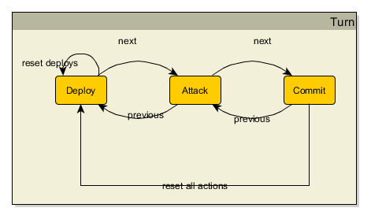
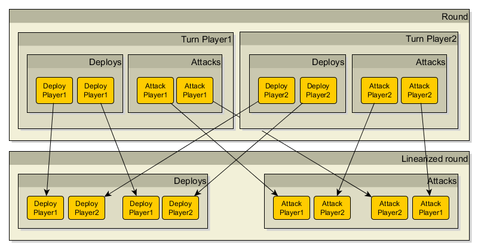
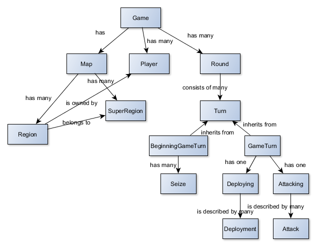

# Umìlá inteligence pro deskovou hru Warlight
## Abstrakt
Warlight, inspirovanı deskovou hrou Risk, pøedstavuje
vızvu pro tvorbu umìlé inteligence z dùvodu obrovského branching
faktoru.

Práce implementuje bota do této hry, kterı je schopnı hrát vyrovnanou hru
s alespoò ménì zkušenım hráèem. Souèástí je také simulátor, mo�nost
hry proti umìlému hráèi i proti jinému lidskému hráèi ve formì hotseat (multiplayer hry na jednom poèítaèi).
Práce je vedena tak, aby umo�nila pou�ití tohoto frameworku pro další vıvoj a testování botù.

## Úvod
<!---popis kontextu, kterého se práce tıká - popis hry, souvislost s riskem--->

### Základní informace o høe
Warlight, inspirovanı deskovou hrou Risk, je hra pro více hráèù odehrávající se na
mapì rozdìlené na regiony. Ty se shlukují do super regionù (kontinentù).
Cílem ka�dého hráèe je dobıt všechny regiony vlastnìné ostatními hráèi.
Na zaèátku hry si hráè volí regiony, ze kterıch bude dobıvat další.
Ka�dé kolo si hráè na svá území staví jednotky.
Pokud ovládá nìjakı super region, mù�e si jich postavit více.
Poté útoèí na své sousedy, popøípadì pøesouvá jednotky. Vıpoèet ztrát jednotek pøi útoku na obou stranách
je pravdìpodobnostní, kde malou vıhodu mají bránící jednotky.

### Motivace a obsah práce
<!--- motivace k vytvoøení práce --->
I pøes existenci soutì�e vypsané Riddles.io na tvorbu AI je tato oblast nepøíliš zmapovaná.
Dùvodem je nezveøejòování implementovanıch prací a jejich malá, èi vùbec �ádná dokumentace.
Neprobádanost, spolu s velkım branching faktorem hry, mì motivuje k pokusu o vytvoøení AI,
která bude schopná hrát vyrovnanou hru s lidskım hráèem.

<!--- co specifiètìji je v mé práci, trošku jak --->
Práce implementuje AI do této hry pou�itím modifikovaného paralelního algoritmu Monte Carlo tree search.
Pro snadnìjší vıvoj je pøidán simulátor pro pozorování her botù proti sobì.
U�ivatel si mù�e sám vyzkoušet hru ve formì singleplayer nebo hotseat multiplayer hry (více hráèù na jednom poèítaèi).

### Struktura práce
- **Popis hry** - cílem první kapitoly popsat ètenáøi hru Warlight
- **Related works** - ???
- **Implementace** - tøetí kapitola popisuje softwarové komponenty pou�ité
pøi vytvoøení této práce, jejich vıznam a interakci.
- **Umìlá inteligence** - ve ètvrté kapitole je rozebrána volba umìlá inteligence a detailnì
zvolenı pøístup k její tvorbì.
V této sekci také rozebereme její poèínaní v urèitıch herních situacích a pøípadnou neoptimalitu.
Na konci této kapitoly jsou demonstrovány vısledky hry této AI proti lidskım hráèùm i jinım AI.
- **Závìr** - závìreèná kapitola obsahuje zhodnocení celého projektu. Dále je uvedeno
mo�né navázání na tuto práci.

## Obsah práce
1. [Úvod]
2. [Popis hry]
3. Related works
4. [Implementace]
5. [Umìlá inteligence]
6. Závìr práce
7. [Seznam pou�ité literatury]

## Popis hry
Pravidla hry Warlight jsou relativnì volná, hra se dá hrát na spoustu rùznıch nastavení.
V této kapitole si vezmeme nastavení, která jsou pou�ívána v této práci,
a popíšeme pravidla hry.

### Mapa
Hra se odehrává na mapì. Ta se dìlí na *regiony*, nejmenší územní celky této hry.
Ka�dı region má armádu, buï hráèe, kterı ho vlastní, nebo je neobsazenı a seznam sousedních regionù.
Regiony se dále shlukují do vìtších územních celkù, *super regionù*.
Narozdíl od hry Risk, mapou mù�e bıt libovolnı neorientovanı graf regionù.

### Zaèátek hry
Na zaèátku hry si hráè zvolí poèáteèní regiony tak, �e od ka�dého super regionu vezme právì jeden.
Tato zvolená území pøedstavují vıchozí body, ze kterıch bude obsazovat další. Jakmile hráè volbu regionù potvrdí,
nelze ji ji� zmìnit.

### Prùbìh hry
- hráèi se støídají po tazích
- odehrají-li všichni hráèi své tahy, dojde k vıpoètu a následnému zmìnìní aktuálního stavu hry
- hra konèí ve chvíli, kdy jeden hráè dobyl území všech ostatních hráèù

### Tah
Tah se dìlí na 3 fáze: deploy, attack, commit. V deploy fázi hráè staví armádu,
v attack fázi posílá útoky a v commit fázi potvrzuje pøedešlé akce.

#### Deploy
V této fázi hráè staví armádu na jím vlastnìnıch regionech.
Hráè má urèenı maximální poèet jednotek, které mù�e v daném tahu postavit.
Od zaèátku hry si hráè mù�e stavìt 5 jednotek. Dobude-li nìjakı super region,
zvıší se mu pøísun jednotek o bonus definovanı super regionem.

#### Attack
V této fázi hráè útoèí jednotkami v�dy ze svého regionu na region sousední.
Po útoku v�dy musí na regionu zùstat alespoò jedna jednotka,
tedy hráè mù�e zaútoèit maximálnì s poètem jednotek - 1 na ka�dém regionu.
Pokud hráè zaútoèí na svùj region, budeme tuto akci nazıvat pøesunem jednotek.

#### Commit
Závìreèná fáze, ve které hráè potvrzuje veškeré své pøedchozí akce.
Po tomto potvrzení není mo�né ji� tahy vrátit a tah je pova�ován za uzavøenı.

### Kolo
Kolo je mno�ina tahù všech hráèù. Jakmile všichni hráèi dokonèí své tahy,
spustí se vıpoèet kola.

Nejprve se akce zlinearizují. To vezme ka�dou fázi zvláš�, a tyto akce v�dy
projde v poøadí ABCABC... (písmena oznaèují hráèe, náhodnì pøiøazené).

Po linearizaci následuje vıpoèet kola. Nejprve jsou spuštìny všechny deploy akce, dojde k
pøidání jednotek na zvolené regiony. Poté jsou spuštìny všechny attack akce.
Vıpoèet attack akcí se øídí následujícími pravidly:

- Pokud hráè z regionu X poslal jednotky na region Y, kterı v dané situaci vlastní jinı hráè,
dojde k vıpoètu ztrát jednotek. Ka�dá útoèící jednotka ma 60% šanci na zabití bránící jednotky,
ka�dá bránící jednotka má 70% šanci na zabití útoèící jednotky.
    - Pokud dojde zabití všech bránících jednotek a nìjaké útoèící pøe�ijí, zbytek tìchto jednotek je pøesunuto
    na dobyté území a útoèící hráè je novım vlastníkem regionu Y.
    - Pokud nejsou zabity všechny bránící jednotky, pak pøe�ivší útoèící se vrátí zpátky na X
    - Pokud jsou zabity všechny jednotky Y i X, na území Y, proto�e minimální poèet jednotek je 1,
    se pøidá jedna jednotka. Vlastníci X i Y zùstávají stejní.
- Pokud hráè z regionu X poslal jednotky na region Y, kterı v dané situaci vlastní také on,
dojde k pøesunu tìchto jednotek, èili nedojde ke ztrátám.
- Pokud hráè z regionu X poslal jednotky na region Y, ale region X mezitím
dobyl jinı hráè, akce útoku X->Y je zrušena.
- Pokud hráè z X na Y poslal *n* jednotek do útoku, ale jinım útokem byla tato útoèící armáda oslabena o k jednotek,
dojde k poslání *n - k* jednotek

## Umìlá inteligence
V této kapitole nejprve zanalyzujeme problematiku hry,
urèíme vhodnou metodu pøístupu k implementaci AI. Následnì
uká�eme naši implementaci pou�itím zvoleného algoritmu,
popíšeme naimplementovanou referenèní AI.
Na závìr otestujeme schopnosti AI a zanalyzujeme vısledky testování.

### Analıza
<!--- na poøadí zále�í --->
Hra Warlight je vıpoèetnì velmi nároèná. Tah je unikátnì
urèen mno�inou deploy a sekvencí attack akcí. Liší-li
se poøadí attack akcí, mù�e to mít velkı vliv na vısledek kola.

<!--- velkı branching faktor --->
Zpùsobù, jak odehrát jeden tah, je velmi mnoho. Jednotky
lze nepøebernì zpùsoby distribuovat na vlastnìné regiony,
a ještì více zpùsoby je lze posílat na regiony sousední.

<!--- nedeterminismus útoku --->
Dalším vızvou je nedeterminismus útoku. Náhoda pøi vıpoètu
útoku mù�e znatelnì ovlivnit novı stav po skonèení kola.

<!--- volba algoritmu --->
Aby algoritmus dobøe poèítal ve velkém stavovém prostoru,
mìl by bıt best-first-search. Aby u�ivatel neèekal pøíliš
dlouho na odpovìï AI, mìl by bıt stanovena maximální doba vıpoètu.
Algoritmus by tedy mìl bıt schopen v tento èas vydat nejlepší odpovìï,
kterou dosud našel. Z tìchto dùvodù byl pro implementaci
AI zvolen algoritmus Monte Carlo tree search.

### Monte Carlo tree search AI
V této sekci nejprve základnì popíšeme algoritmus MCTS,
následnì uká�eme jeho úpravy pro hru Warlight. Pro
zvıšení vıkonu je prozkoumán a zvolen jeden z pøístupù
k paralelizaci tohoto algoritmu.

#### Úvod do MCTS
Monte Carlo tree search je algoritmus, jeho� cílem je
najít nejlepší tah v daném stavu hry. Pro tento úèel
je stavìn vıpoèetní strom. Jeho vrcholy pøedstavují
stavy hry, hrany pøedstavují akce, které do nich vedou.
Na vrcholu je navíc ulo�en poèet vıher a poèet celkovıch her,
které se dotkly stavu hry v nìm ulo�ené.
V koøeni je ulo�en stav hry, ze kterého se pokoušíme nalézt
nejlepší tah.

Algoritmus popisují 4 fáze: selekce, expanze, simulace a zpìtná propagace.
1. *Selekce* - zaèni v koøeni, v ka�dém potomkovi v�dy zvol potomka 
podle urèité funkce, dokud nedospìješ do listu
2. *Expanze* - zvolenému listu *selekcí* pøidej *n* potomkù a zvol jednoho z nich
3. *Simulace* - ze zvoleného potomka zaèni náhodnì hrát, dokud jeden z hráèù neprohraje
4. *Zpìtná propagace* - propaguj informaci o vıhøe/prohøe zpìt a� do koøene

#### Modifikace MCTS
Základní forma MCTS je pro Warlight stále nepou�itelná.
V této sekci jsou popsány modifikace algoritmu tak,
aby efektivnì nacházel nejlepší tah v prostøedí této hry.

##### Úpravy vıpoèetního stromu
Ve høe Warlight nejprve všichni hráèi odehrají své tahy,
a� poté dojde k vıpoètu kola. Jak by mìl tedy vypadat vıpoèetní strom?

<!--- vlastník vrcholu --->
U ka�dého vrcholu proto navíc urèíme jeho vlastníka. To bude
hráè, kterı odehrál tah vedoucí do tohoto vrcholu. U 
koøene definujeme jako vlastníka hráèe,
z jeho� perspektivy se sna�íme najít nejlepší tah.
Od následujících úrovní hloubky stromu se bude vlastnictví
v�dy støídat.

<!--- stav mapy v ka�dém sudém vrcholu --->
Stav mapy staèí mít ulo�enı v koøeni a ve vrcholech vlastnìnıch nepøítelem,
proto�e jeho tah je posledním tahem kola.

##### Ohodnocovací funkce

##### Generátory akcí

#### Paralelní MCTS

### Agresivní bot

### Testování

## Implementace
Náplní této kapitoly je seznámit ètenáøe se soubory potøebnımi pro hru a
základními komponentami a jejich vztahy.

Projekt je implementován v jazyce C\# verze 7.2 pro .NET verze 4.5.

### Soubory
V této sekci jsou popsány soubory vytváøené nebo pøilo�ené k projektu a jejich vıznam.

#### Mapy
Soubory map se nachází ve slo�ce *Maps*. Pro reprezentaci mapy jsou potøeba 4 soubory.
Ke høe je pøilo�ena mapa svìta, s podobnımi 4 soubory lze však reprezentovat libovolnou mapu.

Pøilo�ené soubory:
- **World.png** - obrázek mapy svìta. Je prezentován u�ivateli.
- **WorldTemplate.png** - obrázek mapy svìta, kde ka�dı region má pøiøazenou unikátní barvu.
Ta slou�í pøi rozpoznávání oblasti, na kterou u�ivatel klikl.
- **World.xml** - obsahuje strukturu mapy svìta, popisuje super regiony a jejich bonusy,
regiony, jejich sousedy, ke kterému super regionu patøí, poèáteèní armády na regionech
- **WorldColorRegionMapping.xml** - pøiøazuje unikátní barvu ka�dému regionu

Šablony, podle kterıch se píší XML na definici struktury dané mapy a pøiøazování unikátní barvy regionu:
- **Map.xsd** - schéma validující XML se strukturou mapy
- **RegionColorMapping.xsd** - schéma validující XML mapování barvy na region

#### Ulo�ené hry a simulátor
Ulo�ené hry se nacházejí ve slo�ce *SavedGames*. Tato slo�ka má dva podadresáøe: *Hotseat* a *Singleplayer*.
Ty urèují, pro jakı typ hry dané ulo�ené hry slou�í.
Ulo�ené hry jsou pojmenovány *{èíslo hry}.sav*, jedná se o binárnì serializovanou *Game* tøídu.

Ulo�enı stav v simulátoru se nachází ve slo�ce *Simulator*. Ten je ulo�en opìt pod jménem *{èíslo hry}.sav*.
Navíc je, pokud bylo v prùbìhu simulace puštìné logování, obsah logu k dané høe ulo�en pod jménem *{èíslo hry}.log*.
V tom je ve zjednodušené formì zapsáno, pro ka�dé kolo, jak AI ohodnotilo jednotlivá území, a jak vyhodnotilo
kvalitu mo�nıch tahù.

### Architektura
Cílem této sekce je projít a popsat hlavní komponenty práce a jejich fungování.

Solution má slo�ky *Client* a *Tests*. *Client* obsahuje projekty, které jsou potøeba na stranì UI,
*Tests* obsahuje unit testy. Další projekty nejsou zahrnuty do �ádné slo�ky.

Projekty, vyjma testovacích, této práce jsou:
*Common, GameObjectsLib, GameHandlersLib, GameAi.Data, GameAi,
FormatConverters, TheAiGames.EngineCommHandler, Communication.CommandHandler,
Client.Entities, WinformsUI*.

V následujících sekcích popíšeme tyto projekty, jejich fungování a vztahy.

#### Projekt Common
Zde nalezneme pomocné tøídy, které nachází vyu�ití napøíè projektem.

**Tøídy**

- *Tree* - generickı n-ární strom
- *BidirectionalDictionary* - dictionary umo�òující rychlé vyhledávání jak podle klíèe, tak podle hodnoty.
Jedná se o wrapper nad dvìma slovníky.
- *IRandomInjectable* - tøídám, které implementují tento interface,
je mo�no injectnout svùj vlastní náhodnı generátor. To slou�í k testování nedeterministickıch tøíd.
- *ObjectPool* - slou�í k poolování libovolnıch objektù za úèelem uvolnìní tlaku na GC.
Pøed ulo�ením do poolu dojde k vyèištìní tohoto objektu od referencí na cizí objekty,
aby se objekt choval podobnì jako novì naalokovaná tøída a nedocházelo tak k memory leakùm.

#### Projekt GameObjectLib
V této knihovnì jsou datové struktury reprezentující mapu, hráèe, hru a její záznam.

Na obrázku vıše je znázornìné zjednodušené schéma popisující objekty a jejich vztahy.

**Tøídy**

- *Map* - reprezentuje mapu hry, obsahuje informaci o všech regionech a super regionech
- *Game* - pøedstavuje hru, má mapu a seznam hráèù, co tuto hru hrají. Obsahuje také
informaci o všech dosud odehranıch kolech.
- *Player* - reprezentuje hráèe hry.
- *Turn* - tah hráèe. Obsahuje seznam útokù a deploy akcí, které hráè v daném kole odehrál.
- *Round* - kolo hry. Má seznam tahù.
- *Attack* - kdo na koho útoèil s jakım poètem jednotek. Kvùli nedeterministickému vıpoètu
obsahuje také informaci o novém stavu hry po útoku (*PostAttackMapChange*).

#### Projekt GameHandlersLib
V tomto projektu se nachází pomocné tøídy UI. Proto�e tato logika je pøenosná i na jiné platformy
ne� desktopové, je tato logika oddìlena od Winforms UI tøíd.
Tøídy tohoto projektu se dìlí na dvì skupiny: map handlery a game handlery.

##### Map handlery
Map handlery slou�í k vykreslování zmìn na mapì do bitmapy. Starají se o vykreslování
poètu jednotek na regiony, pøekreslování barev regionù a zvıraznìní regionù.

**Tøídy**

- *ColoringHandler* - pøekresluje region na po�adovanou barvu. Dùraz byl kladen èasovì
efektivní implementaci.
- *TextDrawingHandler* - vykresluje text na obrázek mapy. Pou�ívá se k vykreslení poètu jednotek na region mapy.
Algoritmus nejprve najde region, na kterı se má èíslo vypsat. Na tomto regionu pak najde unikátnì zbarvenı
pixel urèující kam napsat toto èíslo, a èíslo pak vypíše.
- *HighlightHandler* - doká�e zvıraznit region. Zvıraznìní probíhá tak, �e
algoritmus vykreslí ka�dı 3. pixel regionu mapy na pøedem zvolenou highlight barvu. 
- *MapImageTemplateProcessor* - pøedstavuje low-level mapování mezi obrázkem a herní objektem regionu.
Umo�òuje pro ka�dı pixel najít region, nebo oznámit, �e na daném místì se region nenachází.
- *MapImageProcessor* - wrapper nad ostatními handlery, kterı zprostøedkovává volání.

##### Game handlery
Game handlery slou�í k obsluze jednotlivıch èástí hry.

**Tøídy**

- *RoundHandler* - zajiš�uje vıpoèet zmìn pøi pøechodu
z jednoho kola do druhého
- *GameFlowHandler* - wrapper, kterı obsahuje pomocné metody,
které se mù�ou z u�ivatelského rozhraní volat.
- *ActionEnumerator* - aby šla odsimulovaná hra
pøehrávat, je potøeba zajistit pøehrávání akcí obìma smìry.
Tato komponenta umo�òuje iterovat pøes akce všech odehranıch
kol obìma smìry.
- *GameRecordHandler* - vyu�itím ActionEnumeratoru umo�òuje
iterovat pøes odehraná herní kola nebo odehrané herní akce.
- *BotEvaluationHandler* - spouští a zastavuje vıpoèet bota pøi simulaci.
- *SimulationFlowHandler* - pomocná tøída pro UI simulátoru,
zajiš�uje provolávání metod do *BotEvaluationHandler*u,
*GameRecordHandleru*

#### Projekt GameAi.Data
Tento projekt obsahuje datové struktury slou�ící k vıpoètu bota a reprezentaci jeho tahu.
Projekt se dìlí do nìkolika adresáøù.

Adresáø *EvaluationStructures* obsahuje
struktury, které jsou potøeba pro vıpoèet. Struktury *MapMin*, *RegionMin* a *SuperRegionMin* jsou
minifikovanım ekvivalentem obdobnì pojmenovanım tøídám v knihovnì *GameObjectsLib*. Pøi jejich
implementaci byl kladen dùraz na minimální velikost. To hraje roli pøi èastém kopírování.
K zajištìní lepšího vıkonu byly místo tøíd pou�ity struktury. Tøída *PlayerPerspective* odpovídá
pohledu na stav hry z perspektivy jednoho urèitého hráèe.

Adresáø *GameRecording* obsahuje tøídy, které jsou zmenšenımi ekvivalenty tøíd z *GameObjectsLib*
slou�ící pro záznam. Tyto tøídy pak pou�ívá AI mimo jiné na návrat nejlepšího nalezeného tahu.

#### Projekt GameAi
V tomto projektu jsou komponenty související s implementací
AI.

Dìlí se na nìkolik skupin:
- *ActionGenerators* - generátory akcí, neboli sekvencí deploy jednotek a útokù,
pro danı stav hry z perspektivy urèitého hráèe. Tyto generátory implementují interface
*IActionsGenerator*. Rozlišují se podle fáze hry:
    - *IGameBeginningActionsGenerator* - implementace generují akce pro zaèátek
    hry
    - *IGameActionsGenerator* - implementace generují akce pro ostatní fáze hry ne� poèáteèní
- *StructureEvaluators* - jedná se o implementace ohodnocovacích
funkcí pro struktury hry, tedy *RegionMin*, *SuperRegionMin* a *PlayerPerspective*

## Seznam pou�ité literatury
[1] *Parallel Monte-Carlo Tree Search*, Guillaume M.J-B. Chaslot, Mark H.M. Winands, and H. Jaap van den Herik

