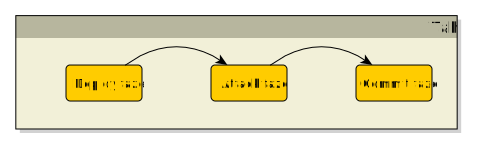
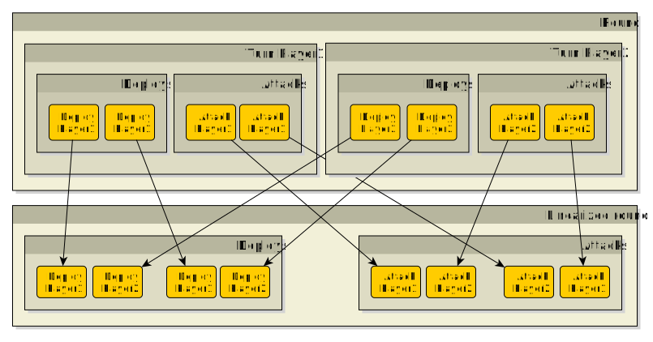
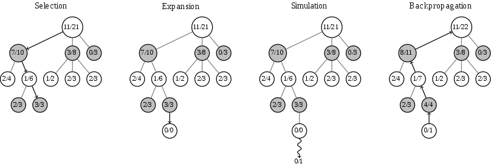
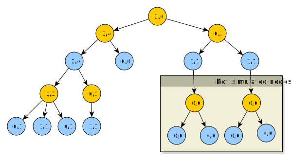
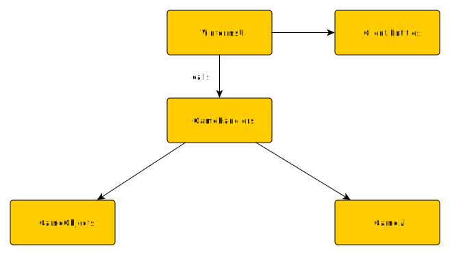
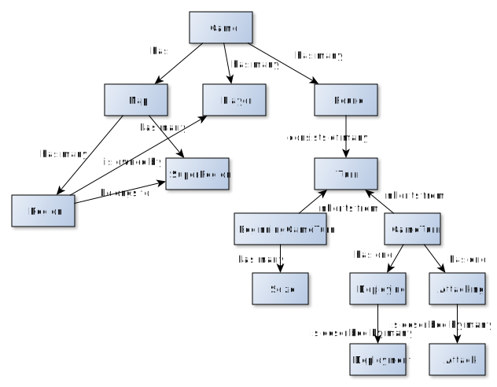

# Umìlá inteligence pro deskovou hru Warlight
## Abstrakt
Warlight, inspirovanı deskovou hrou Risk, pøedstavuje
vızvu pro tvorbu umìlé inteligence z dùvodu obrovského branching
faktoru.

Práce implementuje umìlou inteligenci do této hry schopnou hrát vyrovnanou hru
s alespoò ménì zkušenım hráèem. Souèástí je také simulátor, mo�nost
hry proti UI i proti jinému lidskému hráèi ve formì hotseat (multiplayer hry na jednom poèítaèi).
Práce je vedena tak, aby umo�nila pou�ití tohoto frameworku pro další vıvoj a testování umìlé inteligence.

## Úvod
<!---popis kontextu, kterého se práce tıká - popis hry, souvislost s riskem--->

### Základní informace o høe
Warlight, inspirovanı deskovou hrou Risk, je hra pro více hráèù odehrávající se na
mapì rozdìlené na regiony. Ty se shlukují do super regionù (kontinentù).
Cílem je dobıt všechny regiony vlastnìné ostatními hráèi.
Na zaèátku hry si hráè volí poèáteèní regiony.
Ka�dé kolo si na svá území nejprve staví jednotky, poté útoèí na své sousedy.
Vıpoèet ztrát jednotek pøi útoku je urèen pravdìpodobnostmi.
Pøi stejném poètu útoèících a bránících jednotek by mìl útoèník utrpìt vyšší ztráty.

### Motivace
<!--- motivace k vytvoøení práce --->
I pøes existenci soutì�e vypsané Riddles.io na tvorbu umìlé inteligence do hry Warlight
je tato oblast nepøíliš zmapovaná.
Dùvodem je nezveøejòování existujících implementací, nebo jejich malá, èi vùbec �ádná dokumentace.
Neprobádanost, spolu s velkım branching faktorem hry, nás motivuje k pokusu o vytvoøení umìlé inteligence,
která bude schopná hrát vyrovnanou hru alespoò s ménì zkušenım hráèem.

### Cíl
<!--- co specifiètìji je v mé práci, trošku jak --->
Cílem práce je naimplementovat umìlou inteligenci do hry Warlight pou�itím
modifikovaného paralelního algoritmu Monte Carlo tree search.
Pro snadnìjší vıvoj umìlé inteligence je dílèím cílem práce pøidat simulátor
pro pozorování her botù proti sobì a hru ve formì singleplayer nebo hotseat
multiplayer hry (více hráèù na jednom poèítaèi).

### Related works
Práce [GG Warlight Strategy Guide.pdf] a [LearningWarlightStrategy.pdf] popisují,
jakımi pravidly by se mìl lidskı hráè øídit pøi hraní Warlightu.

Práce [MHuntersWarLightStrategyGuide.pdf] obsahuje sadu rad, jak by se umìlá inteligence mìla
chovat v rùznıch herních situacích.

Práce [Parallelmcts.pdf] rozebírá pøístupy k implementaci algoritmu Monte Carlo tree search
paralelnì. Jejich efektivita je mìøena na høe Go.

### Struktura práce
- **Pravidla hry** - cílem první kapitoly je detailnì popsat ètenáøi pravidla hry
Warlight.
- **Umìlá inteligence** - ve druhé kapitole prozkoumáme umìlou inteligenci implementovanou
v této práci. Zamìøíme se na obecnì pou�itı algoritmus a jeho modifikace pøizpùsobené znalostem této hry.
Nakonec rozebereme vısledky hry naší umìlé inteligence proti lidskım hráèùm i jinım AI. Zamìøíme
se na prùzkum jejich nedostatkù a problémová místa (mo�ná má bıt ve future work??).
- **Implementace** - tøetí kapitola popisuje soubory související s prací a strukturu a vıznam hlavních
implementovanıch tøíd.
- **Závìr** - závìreèná kapitola zhodnocuje celé dílo. Nakonec uvádí mo�né navázání na tuto práci.

## Obsah práce
1. [Pravidla hry]
2. [Umìlá inteligence]
3. [Implementace]
4. Závìr práce
5. [Seznam pou�ité literatury]

## Pravidla hry
Pravidla hry Warlight jsou relativnì volná, hra se dá hrát na spoustu rùznıch nastavení.
V této kapitole si vezmeme nastavení, která jsou pou�ita v této práci,
a popíšeme pravidla hry.

### Mapa
Hra se odehrává na mapì. Ta se dìlí na *regiony*, nejmenší územní celky této hry.
Ka�dı region má armádu, seznam sousedních regionù, a buï hráèe, kterı ho vlastní, nebo je neobsazenı.
Regiony se dále shlukují do vìtších územních celkù, *super regionù*.
Mapou mù�e bıt libovolnı neorientovanı graf regionù.

### Zaèátek hry
Na zaèátku hry si hráè zvolí poèáteèní regiony tak, �e od ka�dého super regionu vezme právì jeden.
Tato zvolená území pøedstavují vıchozí body, ze kterıch bude obsazovat další.

### Prùbìh hry
- hráèi se støídají po tazích
- odehrají-li všichni hráèi své tahy, dojde k vıpoètu a následné zmìnì stavu hry
- hra konèí ve chvíli, kdy jeden hráè dobude území všech ostatních hráèù

### Tah
Tah se dìlí na 3 fáze: deploy, attack a commit. V deploy fázi hráè staví armádu,
v attack fázi posílá útoky a v commit fázi potvrzuje své pøedchozí akce.



#### Deploy
V této fázi hráè staví armádu na ním vlastnìnıch regionech.
Hráè má urèenı maximální poèet jednotek, které mù�e v daném tahu postavit.
Od zaèátku hry si mù�e stavìt 5 jednotek. Dobude-li nìjakı super region,
zvıší se mu pøísun jednotek o bonus definovanı super regionem.

#### Attack
V této fázi hráè útoèí jednotkami v�dy ze svého regionu na region sousední,
popøípadì jednotky pøesouvá mezi svımi sousedními regiony.
Pøi útoku nelze útoèit s celou armádou. Musí na regionu zùstat alespoò jedna jednotka.

#### Commit
V této fázi hráè potvrzuje své veškeré pøedchozí akce.
Po tomto potvrzení ji� není mo�né je vrátit a tah je pova�ován za uzavøenı.

### Kolo
Ka�dı hráè pøispívá do kola právì jedním tahem. Vıpoèet kola se spouští, jakmile všichni hráèi potvrdí
své akce commitem.

Ty se nejprve zlinearizují, poté následuje vıpoèet zmìn.

#### Linearizace



Algoritmus:
```
Linearizuj() : kolo
    tahy = { všechny t | t je odehranı tah }
    zpøeházejNáhodnì(tahy);

    // zlinearizuj deploy akce
    deploy = {}
    pro ka�dı index i = 1, ..., maximum(poèet deploy akcí libovolného tahu)
        iDeploy := { i-té deploy akce všech tahù }
        deploy.pøidej(iDeploy)

    // zlinearizuj attack akce
    attack = {}
    pro ka�dı index i = 1, ..., maximum(poèet attack akcí libovolného tahu)
        iAttack := { i-té attack akce všech tahù }
        zpøeházejNáhodnì(iAttack)
        deploy.pøidej(iAttack)

    linearizovanéKolo = (deploy, attack)
    vra� linearizovanéKolo

```

#### Vıpoèet zmìn
Nejprve jsou spuštìny všechny deploy akce - dojde k pøidání jednotek na zvolené regiony.

Poté jsou spuštìny všechny attack akce. Vıpoèet ztrát jednotek v boji se øídí následujícími pravidly:
- Ka�dá útoèící jednotka má 60% šanci na zabití bránící jednotky.
- Ka�dá bránící jednotka má 70% šanci na zabití útoèící jednotky.

Algoritmus pro spoèítání zmìn zpùsobenıch útoky:
```
spoèítejAttacky(linearizovanéAttacky)
    pro ka�dı attack v linearizovanéAttacky
        X := attack.útoèícíRegion
        Y := attack.bránícíRegion
        útoèícíHráè := attack.útoèícíHráè;

        // útoèící region zmìnil vlastníka
        pokud X.vlastník != útoèícíHráè
            pøeskoè tento útok

        // v�dy musí zbıt alespoò jedna jednotka na regionu
        reálnáÚtoèícíArmáda := minimum(attack.útoèícíArmáda, X.armáda - 1)
        bránícíArmáda := Y.armáda

        // hráè útoèí na svùj region
        pokud útoèícíHráè == Y.vlastník
            pøesuò jednotky
        jinak
            // spoèítej zabité jednotky
            zabitéÚtoèícíJednotky :=
                spoèítejZabitéÚtoèícíJednotky(reálnáÚtoèícíArmáda, bránícíArmáda)
            zabitéBránícíJednotky :=
                spoèítejzabitéBránícíJednotky(bránícíArmáda, reálnáÚtoèícíArmáda)
            
            pokud byly zabity všechny útoèící i bránící jednotky
                bránícíArmáda := 1
            jinak pokud byly zabity všechny bránící, ale útoèící ne
                Y.vlastník := útoèícíHráè
            jinak pokud pøe�ily i bránící i útoèící
                vra� se s pøe�ivšími útoèícími jednotkami zpìt na X
            jinak pokud pøe�ily bránící
                // nic nedìlej
        
```

## Umìlá inteligence
<!--- popis kapitoly --->
V této kapitole nejprve zanalyzujeme problematiku hry a
urèíme vhodnou metodu pøístupu k implementaci AI. Následnì
uká�eme naši implementaci pou�itím zvoleného algoritmu,
popíšeme naimplementovanou referenèní umìlé inteligence.
Na závìr otestujeme schopnosti AI a zanalyzujeme vısledky testování.

<!--- vymezení (mo�ná na jiné místo?) --->
Vytvoøená umìlá inteligence je schopná hrát pouze hry 1v1.

### Analıza
<!--- na poøadí zále�í --->
Hra Warlight je vıpoèetnì velmi nároèná. Tah je unikátnì
urèen mno�inou deploy a sekvencí attack akcí. Liší-li
se poøadí attack akcí, mù�e to mít velkı vliv na vısledek kola.

<!--- velkı branching faktor --->
Zpùsobù, jak odehrát jeden tah, je velmi mnoho. Jednotky
lze nepøebernì zpùsoby distribuovat na vlastnìné regiony,
a ještì více zpùsoby je lze posílat na regiony sousední.

<!--- nedeterminismus útoku --->
Dalším vızvou je nedeterminismus útoku. Náhoda pøi vıpoètu
útoku mù�e znatelnì ovlivnit novı stav po skonèení kola.

<!--- volba algoritmu --->
Aby algoritmus dobøe poèítal ve velkém stavovém prostoru,
mìl by bıt best-first-search. Aby u�ivatel neèekal pøíliš
dlouho na odpovìï AI, mìl by bıt stanovena maximální doba vıpoètu.
Algoritmus by tedy mìl bıt schopen v tento èas vydat nejlepší odpovìï,
kterou dosud našel. Z tìchto dùvodù byl pro implementaci
AI zvolen algoritmus Monte Carlo tree search.

### Monte Carlo tree search AI
V této sekci nejprve základnì popíšeme obecnì algoritmus MCTS,
následnì uká�eme jeho úpravy pro hru Warlight. Pro
zvıšení vıkonu je prozkoumán a zvolen jeden z pøístupù
k paralelizaci tohoto algoritmu.

**Terminologie**
- *náš hráè* - hráè z jeho� pohledu se sna�íme najít nejlepší tah
- *nepøátelskı hráè* - hráè, co není náš hráè

#### Úvod do MCTS
Monte Carlo tree search je algoritmus, jeho� cílem je
najít nejlepší tah v daném stavu hry. Pro tento úèel
je stavìn vıpoèetní strom. Jeho vrcholy pøedstavují
stavy hry, hrany pøedstavují akce, které do nich vedou.
Na vrcholu je navíc ulo�en poèet vıher a poèet celkovıch her,
které se dotkly stavu hry v nìm ulo�ené.
V koøeni je ulo�en stav hry, ze kterého se pokoušíme nalézt
nejlepší tah.
Nejlepší odpovìï reprezentuje ta hrana, která vede do vrcholu s nejvyšším poètem celkovıch her.

Algoritmus popisují 4 fáze: selekce, expanze, simulace a zpìtná propagace.
1. *Selekce* - zaèni v koøeni, v ka�dém potomkovi v�dy zvol potomka 
podle pøedem definované funkce, dokud nedospìješ do listu
2. *Expanze* - zvolenému listu *selekcí* pøidej *n* dìtí a zvol jedno z nich
3. *Simulace* - ze zvoleného potomka zaèni náhodnì hrát, dokud jeden z hráèù neprohraje
4. *Zpìtná propagace* - propaguj informaci o vıhøe/prohøe (0/1) zpìt a� do koøene.



##### Volba potomka v selekci
Funkce na volbu potomka v selekci potøebuje prozkoumávat nejen nejlepší varianty,
ale i zkoušet nové (problém *exploitation a exploration*).

[Kocsis a Csaba] navrhli funkci:

*wi / ni + c * sqrt(ln(Ni) / ni)*, kde

- wi - poèet vıher v daném vrcholu
- ni - poèet her v daném vrcholu
- Ni - celkovı poèet her (= poèet her v koøeni)
- c - konstanta, teoreticky rovná *sqrt(2)*

Pokud *ni* je rovno 0, pak hodnota tohoto vrcholu je *infinity*.
Tato situace se stane expandovaného vrcholu, ze kterého ještì nebyla vedena simulace.

#### Modifikace MCTS
Základní forma MCTS je pro Warlight stále nepou�itelná.
V této sekci jsou popsány modifikace algoritmu tak,
aby efektivnì nacházel nejlepší tah v prostøedí této hry.

##### Úpravy vıpoèetního stromu
Ve høe Warlight nejprve všichni hráèi odehrají své tahy,
a� poté dojde k vıpoètu kola. Jak by mìl tedy vypadat vıpoèetní strom?

<!--- vlastník vrcholu --->
Hrana bude reprezentovat tah hráèe.
U ka�dého vrcholu urèíme navíc jeho vlastníka. To bude
hráè, kterı odehrál tah vedoucí do tohoto vrcholu.
Vlastníkem koøene a jeho dìtí bude náš hráè.
Od následujících úrovní hloubky stromu se bude vlastnictví
v�dy støídat zaèínaje od nepøítele.

<!--- stav mapy v ka�dém sudém vrcholu --->
Stav mapy staèí mít ulo�enı v koøeni a ve vrcholech vlastnìnıch nepøítelem, proto�e
jeho tah je posledním tahem kola.



Na obrázku:
- �lutá - hráè za kterého se pokoušíme najít nejlepší tah
- modrá - nepøátelskı hráè
- stav hry mají v sobì ulo�ené pouze modré vrcholy a koøen

<!--- expanze v�dy po dvou --->
Ve høe Warlight v�dy dochází k odehrání kola a� po odehrání tahù všech hráèù.
Expanze proto nejprve listu zvolenému selekcí pøidá vrcholy urèené tahy
našeho hráèe, a tìm rovnou pøidá jako potomky vrcholy urèené tahy hráèe nepøátelského.

##### Ohodnocovací funkce
Vysokı branching faktor a cyklení znemo�òuje pou�ití náhodné simulace,
která by skonèila a� ve chvíli vıhry jednoho z hráèù.
Místo toho odsimulujeme pøedem urèenı poèet tahù, ohodnotíme pozici a zpìtnou propagací vrátíme èíslo v intervalu [0, 1]
urèující kvalitu pozice.
Tuto hodnotu pak propagujeme do koøene.

Abychom mohli získat pøehled o celkové pozici, potøebujeme ohodnotit dílèí èásti.

###### Ohodnocení super regionu
Ohodnocení super regionu se liší pøi zaèátku hry, a pozdìji.

Pøi zaèátku hry, ze znalosti Warlightu, víme, �e:

- je vıhodné brát super region, kterı má málo sousedících regionù,
proto�e po dobytí se bude lépe bránit
- lepší je super region s více sousedními super regiony, proto�e mù�eme
narušovat bonusy nepøátelùm nebo rychle dobıvat další super regiony
- je lepší, kdy� super region má bonus
- je nevıhodné brát super region, kterı se skládá z hodnì regionù,
proto�e ho je tì�ké dobıt a trvá to dlouho

Tyto znalosti jsou poskládány do vzorce ohodnocovací funkce pro super region:

```
hodnota := a * bonus + b * sousední_super_regiony - c * sousední_regiony - d * regiony_super_regionu
```

kde a, b, c, d jsou reálné konstanty.

V pozdìjších fázích hry se ohodnocovací funkce liší pouze v hodnotách konstant.

###### Ohodnocení regionu
Pøi ohodnocování regionu zále�í také, zdali je zaèátek hry èi ne.

Pøi zaèátku hry:

- není dobré brát více regionù blízko vedle sebe
- hodnota super regionu má vliv na hodnotu regionu
<!--- TODO --->

###### Ohodnocení pozice hráèe
Budeme ohodnocovat ka�dého hráèe zvláš�. Pro ohodnocení hráèovy pozice
porovnáme jeho hodnotu s hodnotou druhého hráèe.

```
hodnotaHráèe(hráè)
    hodnota := 0

    pro ka�dı region vlastnìnı tímto hráèem
        hodnota += ohodnoceníRegionu(region)
        hodnota += ohodnoceníArmády(region.armáda)
    
    vra� hodnota
```

```
ohodnoceníPoziceHráèe1(hráè1, hráè2)
    hodnotaHráèe1 := hodnotaHráèe(hráè1)
    hodnotaHráèe2 := hodnotaHráèe(hráè2)
    
    ohodnoceníPozice1 := hodnotaHráèe1 / (hodnotaHráèe1 + hodnotaHráèe2)

    vra� ohodnoceníPozice1
```

##### Generátory akcí
<!--- motivace --->
Poèet mo�nıch pokraèování v pozici je pøíliš velkı.
Algoritmus nemá dostatek èasu na procházení všech mo�ností.
Potøebujeme nìjakım zpùsobem zmenšit stavovı prostor.

<!--- popsat, co je generátor akcí a co dìlá --->
Klíèem k tomu je generátor akcí. To je softwarová komponenta,
jejím� úèelem je nalézt mno�inu smysluplnıch tahù, které
hráè mù�e pou�ít.

<!-- popsat, jak funguje pøesnì --->
Náš akèní generátor nejprve vygeneruje mo�nosti, jak udìlat deploy,
potom pro ka�dou z tìchto mo�ností vygeneruje mo�nosti, jak zaútoèit.

Algoritmus:
```
vygenerujTahy(stavHry) : tahy
    tahy := {}
    
    // vygeneruje mo�nosti, jak udìlat deploy
    deploy := vygenerujDeploy(stavHry)

    pro ka�dou sekvenci deployAkcí z deploy
        // pøehrej deploy sekvenci akcí
        aktualizovanıStav := pøehrejDeploySekvenci(stavHry, deployAkce)
    
        // vygeneruj mo�nosti jak zaútoèit pro danı deploy
        útoky := vygenerujMo�nostiÚtoku(aktualizovnıStav)

        pro ka�dı útok z útoky
            tahy.pøidej(deployAkce, útok)

    odstraòDuplikáty(tahy)
    vra� tahy
```

###### Generování deploy akcí
Pou�ívá 3 pøístupy v generování deploy akcí: útoènı, obrannı a expanzivní.

1. *Útoènı* - postaví jednotky na region sousedící
s neobsazenım nebo nepøátelskım regionem,
kterı je nejcennìjší (má nejvyšší hodnotu podle ohodnocovací funkce).

2. *Obrannı* - postaví jednotky na mé nejcennìjší regiony takové,
kterım hrozí dobytí nepøítelem.

3. *Expanzivní* - postaví jednotky na region sousedící
s nejcennìjším neobsazenım regionem.

###### Generování attack akcí
<!--- zále�í na poøadí --->
Pøi útoèení, narozdíl od stavìní jednotek, zále�í na poøadí.
Napøíklad máme-li pozici, kde X je mùj region s armádou 8
a Y je s armádou také 8, je rozdíl, zdali X zále�í první na
Y nebo naopak, proto�e obránce má vıhodu.

<!--- pøesouvání jednotek z vnitrozemí k okraji --->
Jednotky, které jsou na našem regionu, kterı má
za sousedy také pouze mé regionu, jsou nevyu�ité.
Vyplatí se je pøesouvat k místùm, kde se budou moci
zapojit do útoku nebo obrany.

```
pøesuòArmádyZVnitrozemí(stavHry)
    pøesuny := {}
    pro ka�dı mùj region
        pokud všichni sousedi regionu jsou moje regiony
            // najdi nejbli�ší region, co není mùj
            cizíRegion := najdiCizíRegion(region)

            // najdi cestu k nìmu
            cesta := najdiNejkratšíCestuMezi(region, cizíRegion)

            // najdi první region na této cestì
            prvníRegionNaCestì := cesta[1]

            pøesun := pošliJednotky(region, prvníRegionNaCestì)

            pøesuny.pøidej(pøesun)
```

Pøi generování attack akcí pou�íváme 3 mo�né varianty:
útoènou, útoènou s vyèkáním, obrannou.

1. *Útoèná* - z ka�dého regionu se v�dy podíváme na
nepøátelské sousední regiony, a potom na nì zaèneme posílat
útoky, dokud naše útoèící armáda je silnìjší ne� armáda bránící.

2. *Útoèná s vyèkáním* - nejprve provedeme pøesun jednotek
z vnitrozemí, poté útoèíme stejnì, jako v pøípadì útoèné varianty.

3. *Obranná* - nejprve pøesuneme jednotky, poté zaèneme posílat útoky.
Ty provádíme ale tak, �e na region zaútoèíme jen s armádou, která
porazí tu nepøátelskou i v pøípadì, �e by na region postavil všechny jednotky,
které mù�e.

#### Paralelní MCTS

### Agresivní bot a Smart random bot

### Vısledky

## Implementace
Náplní této kapitoly je seznámit ètenáøe se soubory potøebnımi pro hru a
základními komponentami a jejich vztahy.

Projekt je implementován v jazyce C\# verze 7.2 pro .NET verze 4.5.

### Soubory
V této sekci jsou popsány soubory vytváøené nebo pøilo�ené k projektu a jejich vıznam.

#### Databáze
Jako databáze je v projektu pou�ita *SQLite*. Do ní se ukládají informace o ulo�enıch
hrách, simulacích a mapách. Pøedstavuje ji soubor *Utils.db*.

#### Mapy
Soubory map se nachází ve slo�ce *Maps*. Pro reprezentaci mapy jsou potøeba 4 soubory.
Ke høe je pøilo�ena mapa svìta, s podobnımi 4 soubory lze však reprezentovat libovolnou mapu.

Pøilo�ené soubory:
- **World.png** - obrázek mapy svìta. Je prezentován u�ivateli.
- **WorldTemplate.png** - obrázek mapy svìta, kde ka�dı region má pøiøazenou unikátní barvu.
Ta slou�í pøi rozpoznávání oblasti, na kterou u�ivatel klikl.
- **World.xml** - obsahuje strukturu mapy svìta, popisuje super regiony a jejich bonusy,
regiony, jejich sousedy, ke kterému super regionu patøí, poèáteèní armády na regionech
- **WorldColorRegionMapping.xml** - pøiøazuje unikátní barvu ka�dému regionu

Šablony, podle kterıch se píší XML na definici struktury dané mapy a pøiøazování unikátní barvy regionu:
- **Map.xsd** - schéma validující XML se strukturou mapy
- **RegionColorMapping.xsd** - schéma validující XML mapování barvy na region

#### Ulo�ené hry a simulátor
Ulo�ené hry se nacházejí ve slo�ce *SavedGames*. Tato slo�ka má dva podadresáøe: *Hotseat* a *Singleplayer*.
Ty urèují, pro jakı typ hry dané ulo�ené hry slou�í.
Ulo�ené hry jsou pojmenovány *{èíslo hry}.sav*, jedná se o binárnì serializovanou *Game* tøídu.

Ulo�enı stav v simulátoru se nachází ve slo�ce *Simulator*. Ten je ulo�en opìt pod jménem *{èíslo hry}.sav*.
Navíc je, pokud bylo v prùbìhu simulace puštìné logování, obsah logu k dané høe ulo�en pod jménem *{èíslo hry}.log*.
V tom je ve zjednodušené formì zapsáno, pro ka�dé kolo, jak AI ohodnotilo jednotlivá území, a jak vyhodnotilo
kvalitu mo�nıch tahù.

### Architektura
Cílem této sekce je projít a popsat hlavní komponenty práce a jejich fungování.

#### Pøehled


Obrázek vıše pøedstavuje základní vztahy mezi projekty.

- *WinformsUI* - grafické komponenty zobrazované uèivateli
- *Client.Entities* - databázové entity
- *GameHandlers* - pomocné jednotky pro UI, starají se o backendovou logiku
u�ivatelskıch pøíkazù a o herní vıpoèty (napø. kola)
- *GameObjects* - reprezentují herní objekty (pø. region, super region, mapu, tah, ...)
- *GameAi* - tøídy slou�ící k vıpoètu umìlé inteligence

#### Projekt WinformsUI
Tento projekt obsahuje grafické komponenty zobrazované u�ivateli: formuláøe
a související user controly.
Ty jsou psány pou�itím Windows Forms technologie. Dìlí se na dvì logické celky:
nastavovací a ingame komponenty.

1. *Nastavovací* - nachází se v adresáøi *GameSetup*. Umo�òují u�ivateli nastavit
hru. Jako pomocné user controly pou�ívají komponenty z adresáøe *HelperControls*.
Nastavovací komponenty se starají o zalo�ení nové hry nebo simulace a naètení ulo�ené hry
nebo simulace.
2. *InGame* - jsou zobrazovány u�ivateli po zalo�ení nebo naètení hry nebo simulace.

    O simulaci se stará tøída *SimulatorInGameControl*. Tato tøída je zobrazena 
    u�ivateli po naètení nebo vytvoøení nové simulace. Pøijímá u�ivatelovy akce
    a pøeposílá je dál komponentì *SimulationFlowHandler* na zpracování.

    O prùbìh hry se starají zbıvající tøídy. Tøída *InGameControl* je zobrazena
    u�ivateli. Ta obsahuje mapu - reprezentována tøídou *MapHandlerControl* starající
    se o u�ivatelskou interakci s mapou, a herní panel. Herní panel je reprezentován
    ve slo�ce *Phases*. Ty se starají o zvládání jednotlivıch fází tahu.

#### Projekt GameObjectLib
V této knihovnì jsou datové struktury reprezentující mapu, hráèe, hru a její záznam.



Na obrázku vıše je znázornìné zjednodušené schéma popisující objekty a jejich vztahy.

**Tøídy**

- *Map* - reprezentuje mapu hry, obsahuje informaci o všech regionech a super regionech
- *Game* - pøedstavuje hru, má mapu a seznam hráèù, co tuto hru hrají. Obsahuje také
informaci o všech dosud odehranıch kolech.
- *Player* - reprezentuje hráèe hry.
- *Turn* - tah hráèe. Obsahuje seznam útokù a deploy akcí, které hráè v daném kole odehrál.
- *Round* - kolo hry. Má seznam tahù.
- *Attack* - kdo na koho útoèil s jakım poètem jednotek. Kvùli nedeterministickému vıpoètu
obsahuje také informaci o novém stavu hry po útoku (*PostAttackMapChange*).

#### Projekt GameHandlersLib
V tomto projektu se nachází pomocné tøídy UI. Proto�e tato logika je pøenosná i na jiné platformy
ne� desktopové, jsou komponenty oddìleny od Winforms UI tøíd.
Tøídy tohoto projektu se dìlí na dvì skupiny: map handlery a game handlery.

##### Map handlery
Map handlery slou�í k vykreslování zmìn na mapì do bitmapy. Starají se o vykreslování
poètu jednotek na regiony, pøekreslování barev regionù a zvıraznìní regionù.

**Tøídy**

- *ColoringHandler* - pøekresluje region na po�adovanou barvu. Dùraz byl kladen èasovì
efektivní implementaci.
- *TextDrawingHandler* - vykresluje text na obrázek mapy. Pou�ívá se k vykreslení poètu jednotek na region mapy.
Algoritmus nejprve najde region, na kterı se má èíslo vypsat. Na tomto regionu pak najde unikátnì zbarvenı
pixel urèující kam napsat toto èíslo, a èíslo pak vypíše.
- *HighlightHandler* - doká�e zvıraznit region. Zvıraznìní probíhá tak, �e
algoritmus vykreslí ka�dı 3. pixel regionu mapy na pøedem zvolenou highlight barvu. 
- *MapImageTemplateProcessor* - pøedstavuje low-level mapování mezi obrázkem a herní objektem regionu.
Umo�òuje pro ka�dı pixel najít region, nebo oznámit, �e na daném místì se region nenachází.
- *MapImageProcessor* - wrapper nad ostatními handlery, kterı zprostøedkovává volání.

##### Game handlery
Game handlery slou�í k obsluze jednotlivıch èástí hry.

**Tøídy**

- *RoundHandler* - zajiš�uje vıpoèet zmìn pøi pøechodu
z jednoho kola do druhého
- *GameFlowHandler* - wrapper, kterı obsahuje pomocné metody,
které se mù�ou z u�ivatelského rozhraní volat.
- *ActionEnumerator* - aby šla odsimulovaná hra
pøehrávat, je potøeba zajistit pøehrávání akcí obìma smìry.
Tato komponenta umo�òuje iterovat pøes akce všech odehranıch
kol obìma smìry.
- *GameRecordHandler* - vyu�itím ActionEnumeratoru umo�òuje
iterovat pøes odehraná herní kola nebo odehrané herní akce.
- *BotEvaluationHandler* - spouští a zastavuje vıpoèet bota pøi simulaci.
- *SimulationFlowHandler* - pomocná tøída pro UI simulátoru,
zajiš�uje provolávání metod do *BotEvaluationHandler*u,
*GameRecordHandleru*

#### Projekt GameAi.Data
Tento projekt obsahuje datové struktury slou�ící k vıpoètu bota a reprezentaci jeho tahu.
Projekt se dìlí do nìkolika adresáøù.

Adresáø *EvaluationStructures* obsahuje
struktury, které jsou potøeba pro vıpoèet. Struktury *MapMin*, *RegionMin* a *SuperRegionMin* jsou
minifikovanım ekvivalentem obdobnì pojmenovanım tøídám v knihovnì *GameObjectsLib*. Pøi jejich
implementaci byl kladen dùraz na minimální velikost. To hraje roli pøi èastém kopírování.
K zajištìní lepšího vıkonu byly místo tøíd pou�ity struktury. Tøída *PlayerPerspective* odpovídá
pohledu na stav hry z perspektivy jednoho urèitého hráèe.

Adresáø *GameRecording* obsahuje tøídy, které jsou zmenšenımi ekvivalenty tøíd z *GameObjectsLib*
slou�ící pro záznam. Tyto tøídy pak pou�ívá AI mimo jiné na návrat nejlepšího nalezeného tahu.

#### Projekt GameAi
V tomto projektu jsou komponenty související s implementací AI.

Dìlí se na nìkolik skupin:
- *ActionGenerators* - generátory akcí, neboli sekvencí deploy jednotek a útokù,
pro danı stav hry z perspektivy urèitého hráèe. Tyto generátory implementují interface
*IActionsGenerator*. Rozlišují se podle fáze hry:
    - *IGameBeginningActionsGenerator* - implementace generují akce pro zaèátek
    hry
    - *IGameActionsGenerator* - implementace generují akce pro ostatní fáze hry ne� poèáteèní
- *StructureEvaluators* - jedná se o implementace ohodnocovacích
funkcí pro struktury hry, tedy *RegionMin*, *SuperRegionMin* a *PlayerPerspective*

## Seznam pou�ité literatury
[1] *Parallel Monte-Carlo Tree Search*, Guillaume M.J-B. Chaslot, Mark H.M. Winands, and H. Jaap van den Herik

