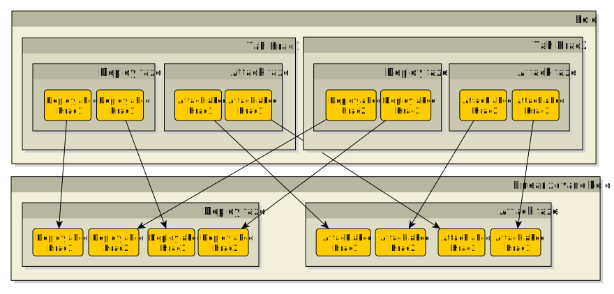

# Umìlá inteligence pro deskovou hru Warlight
## Abstrakt
Warlight, inspirovanı deskovou hrou Risk, pøedstavuje
vızvu pro tvorbu umìlé inteligence z dùvodu obrovského branching
faktoru.

Práce implementuje umìlou inteligenci do této hry schopnou hrát vyrovnanou hru
s alespoò ménì zkušenım hráèem. Souèástí je také simulátor, monost
hry proti UI i proti jinému lidskému hráèi ve formì hotseat (multiplayer hry na jednom poèítaèi).
Práce je navrena tak, aby umonila pouití tohoto frameworku pro další vıvoj a testování umìlé inteligence.

## Úvod
<!---popis kontextu, kterého se práce tıká - popis hry, souvislost s riskem--->

### Základní informace o høe
Warlight, inspirovanı deskovou hrou Risk, je hra pro více hráèù zjednodušenì
simulující skuteènı váleènı konflikt. Kadı hráè zaèíná na 2 území. Cílem
hry je dobıt všechna území vlastnìné ostatními hráèi. Nedílnou souèástí této hry 
je také náhoda, která rozhoduje o mnoství ztrát pøi kadém boji.

### Motivace
<!--- motivace k vytvoøení práce --->
I pøes existenci soutìe vypsané Riddles.io je oblast tvorby umìlé inteligence pro hru Warlight nepøíliš zmapovaná.
Dùvodem je nezveøejòování existujících implementací, nebo jejich malá èi vùbec ádná dokumentace.
Neprobádanost, spolu s velkım branching faktorem hry, nás motivuje k pokusu o vytvoøení umìlé inteligence,
která bude schopná hrát vyrovnanou hru alespoò s ménì zkušenım hráèem.

### Cíl práce
<!--- co specifiètìji je v mé práci, trošku jak --->
Cílem práce je naimplementovat umìlou inteligenci do hry Warlight.
Pro snadnìjší vıvoj umìlé inteligence je dílèím cílem práce pøidat simulátor
pro pozorování her botù proti sobì a hru ve formì singleplayer nebo hotseat
multiplayer hry (více hráèù na jednom poèítaèi).

### Related works
Práce [GG Warlight Strategy Guide.pdf] a [LearningWarlightStrategy.pdf] popisují,
jakımi pravidly by se mìl lidskı hráè øídit pøi hraní Warlightu. Poznatky z tìchto prací
jsou vyuity pøi tvorbì generátoru akcí pro AI.

Práce [MHuntersWarLightStrategyGuide.pdf] obsahuje sadu rad, jak by se umìlá inteligence mìla
chovat v rùznıch herních situacích. Ty jsou vyuity pøi implementaci generátoru akcí a funkcí ohodnocujících stav
v AI.

Práce [Parallelmcts.pdf] rozebírá pøístupy k implementaci algoritmu Monte Carlo tree search
paralelnì. Jejich efektivita je mìøena na høe Go. Prací zmínìná Koøenová paralelizace je pouita
pro paralelizování vıpoètu v naší implementaci umìlé inteligence.

### Struktura práce
Práce se skládá ze 4 kapitol vyjma úvodu:
- **Pravidla hry** - cílem první kapitoly je detailnì popsat ètenáøi pravidla hry
Warlight.
- **Umìlá inteligence** - ve druhé kapitole zanalyzujeme problém tvorby umìlé inteligence do hry Warlight a vybereme vhodnı algoritmus. Zamìøíme se na obecnì pouitı algoritmus a jeho modifikace pøizpùsobené znalostem této hry.
Nakonec rozebereme vısledky hry naší umìlé inteligence proti lidskım hráèùm i jinım AI. Zamìøíme
se na prùzkum jejich nedostatkù a problémová místa.
- **Implementace** - tøetí kapitola popisuje soubory související s prací a strukturu a vıznam hlavních
implementovanıch tøíd.
- **Závìr** - závìreèná kapitola zhodnocuje celé dílo. Nakonec uvádí moné navázání na tuto práci.

## Obsah práce
1. [Pravidla hry]
2. [Umìlá inteligence]
3. [Implementace]
4. Závìr práce
5. [Seznam pouité literatury]

## Pravidla hry
Pravidla hry Warlight jsou relativnì volná, hra se dá hrát na spoustu rùznıch nastavení, která 
se liší pøedevším v míøe náhody pøi útoèení a zpùsobu volení regionù na zaèátku hry.
Cílem této kapitoly je popsat pravidla hry Warlight s nastavením implementovanım v této práci.

### Mapa
Hra se odehrává na mapì. Ta se dìlí na *regiony*, nejmenší územní celky této hry.
Kadı region má armádu, seznam sousedních regionù, a buï hráèe, kterı ho vlastní, nebo je neobsazenı.
Regiony se dále shlukují do vìtších územních celkù, *super regionù*.
Mapou mùe bıt libovolnı neorientovanı graf regionù.

V práci je naimplementována jediná mapa slouící pro úèely testování a hraní - mapa svìta.


Regiony této mapy jsou ohranièená území na obrázku, Super regiony jsou kontinenty - Afrika, Asie, Austrálie, Evropa, Severní a Jiní Amerika.

### Zaèátek hry
Na zaèátku hry je pro kadého hráèe vygenerována mnoina regionù tak, e od kadého super regionu jsou zvoleny právì 2 regiony.
Hráè si z této mnoiny vybírá 2 regiony. Tato území pøedstavují vıchozí body, ze kterıch bude obsazovat další.
Commitem potvrzuje své pøedchozí akce

### Prùbìh hry
Hra se dìlí na herní kola. Kadé herní kolo
se skládá z tahù, kde kadı hráè pøispívá do kola právì jedním tahem.

Bìhem hry se hráèi se støídají po tazích. Odehrají-li všichni hráèi své tahy,
dojde k ukonèení kola. Poté dojde k vıpoètu nového stavu hry, tedy vıpoètu ztrát jednotek a 
pøípadnıch zmìn vlastníkù regionù a k zapoèetí nového kola. Tyto kroky se opakují,
dokud jeden hráè neobsadí regiony všech ostatních hráèù, a nevyhraje tak hru.

### Tah
Tah se dìlí na 3 fáze: deploy, attack a commit.
V deploy fázi hráè staví armádu, v attack fázi posílá útoky a v commit fázi potvrzuje své pøedchozí akce.

Pøechody mezi tìmito fázemi se øídí následujícím schématem:


#### Deploy fáze
V této fázi hráè staví armádu na ním vlastnìné regiony.

*Deploy akcí* nazveme jev, kdy hráè postaví nenulovı poèet jednotek na danı region.
Deploy fáze se skládá z 0 nebo více deploy akcí. Pokud v jedné deploy fázi je více deploy akcí stavìjící jednotky na stejnı region,
tyto akce jsou slouèeny - více deploy akcí se nahradí
jednou, která postaví souèet všech jednotek postavenıch deploy akcemi na danı region.

Hráè má urèenı maximální poèet jednotek, které mùe v daném tahu postavit.
Na zaèátku hry mùe stavìt 5 jednotek. Dobude-li nìjakı super region,
zvıší se mu pøísun jednotek o bonus definovanı super regionem. Pokud o super region pøijde,
pøijde také o bonus jím poskytovanı.

Super regiony mapy svìta mají následující bonusy:
- Asie - 7
- Evropa - 5
- Severní Amerika - 5
- Jiní Amerika - 2
- Afrika - 3
- Austrálie - 3

#### Attack fáze
V této fázi hráè útoèí armádou vdy ze svého regionu na region sousední,
popøípadì jednotky pøesouvá mezi svımi sousedními regiony.

*Attack akcí* nazveme jev, kdy hráè pošle nenulovı poèet jednotek z jím vlastnìného regionu
na region sousední. Attack fáze se skládá z 0 nebo více attack akcí. Pokud v jedné attack fázi je více attack akcí takovıch,
e útok vychází ze stejnıch regionù a míøí do stejnıch regionù, pak jsou tyto akce slouèeny - z více se vytvoøí jedna
attack akce, která bude ze stejnıch regionù a míøit do stejnıch regionù a armáda bude souèet všech vyslanıch jednotek pro dyné dva regiony.

Pøi útoku nelze útoèit s celou armádou. Na regionu zùstat alespoò jedna jednotka.

#### Commit fáze
V této fázi hráè potvrzuje akce, které provedl v deploy a attack fázi.
Po tomto potvrzení ji není moné je vrátit a hráèùv tah je povaován za uzavøenı.

### Kolo
Kadı hráè pøispívá do kola právì jedním tahem. Jakmile všichni ukonèí své tahy commitem, spustí se vıpoèet kola, kterı aktualizuje herní
stav.

Tahy posledního kola se nejprve zlinearizují, poté následuje vıpoèet zmìn.

#### Linearizace
Linearizace je algoritmus, kterı zjednoduší vnoøenou strukturu tahù. Z kola
vytvoøí linearizované kolo. To má stejnou strukturu jako tah a
obsahuje všechny deploy a attack akce tahù daného kola, ale ve zmìneném poøadí.



Algoritmus nejprve zlinearizuje deploy akce tak, e pro kadé i vezme i-té deploy
akce všech tahù daného kola (v poøadí, ve kterém jsou tahy zapsány) a pøidá je do vıstupního seznamu.
Poté zlinearizuje attack akce tak, e pro kadé i vezme i-té attack akce
kadého tahu, a v náhodném poøadí je pøidá do vıstupního seznamu.
Linearizované kolo je tvoøeno dvìma vıše popsanımi vıstupními seznamy.

**Pseudokód**
```
Linearizuj() : kolo
    tahy = { všechny t | t je odehranı tah }
    zpøeházejNáhodnì(tahy);

    // zlinearizuj deploy akce
    deploy = {}
    pro kadı index i = 1, ..., maximum(poèet deploy akcí libovolného tahu)
        iDeploy := { i-té deploy akce všech tahù }
        deploy.pøidej(iDeploy)

    // zlinearizuj attack akce
    attack = {}
    pro kadı index i = 1, ..., maximum(poèet attack akcí libovolného tahu)
        iAttack := { i-té attack akce všech tahù }
        zpøeházejNáhodnì(iAttack)
        deploy.pøidej(iAttack)

    linearizovanéKolo = (deploy, attack)
    vra linearizovanéKolo

```

#### Vıpoèet zmìn kola
Pøi vıpoètu zmìn kola dojde k aktualizaci herního stavu provedením všech zlinearizovanıch akcí.

Nejprve jsou spuštìny všechny deploy akce - jednotky jsou pøidány na hráèi regiony.

Poté jsou spuštìny všechny attack akce - dojde k vıpoètu ztrát jednotek v boji a pøípadné zmìnì vlastníkù regionù.
Vıpoèet ztrát se øídí následujícími pravidly:
- Kadá útoèící jednotka má 60% šanci na zabití bránící jednotky.
- Kadá bránící jednotka má 70% šanci na zabití útoèící jednotky.

Následující algoritmus spoèítá všechny zmìny zpùsobené útoky a zaktualizuje tak
souèasnı herní stav.
Algoritmus implementuje následující pravidla:
- pokud útoèící region zmìnil vlastníka, tento útok se neprovede (byl by proveden jednotkami hráèe, kterı útok neposlal)
- nelze zaútoèit tak, e na regionu nezùstane ádná jednotka - vdy musí zùstat alespoò 1
- útoèí-li hráè na svùj region, nedochází ke ztrátám na jednotkách
- pokud pøi útoku dojde k zabití útoèících i bránících jednotek, na bránící je pøiøazena 1 jednotka (a nemìní se jeho majitel)
- pokud pøi útoku jsou zabity všechny bránící, ale nìjaká útoèící jednotka pøeila, novım vlastníkem regionu je útoèící hráè a zbytek
útoèících jednotek se pøesune na dobytı region
- pokud pøi útoku pøeily bránící i útoèící jednotky, zbytek pøeivších útoèících jednotek se po útoku vrátí na region, ze kterého pøišly

**Pseudokód**
```
spoèítejAttacky(linearizovanéAttacky)
    pro kadı attack v linearizovanéAttacky
        X := attack.útoèícíRegion
        Y := attack.bránícíRegion
        útoèícíHráè := attack.útoèícíHráè;

        // útoèící region zmìnil vlastníka
        pokud X.vlastník != útoèícíHráè
            pøeskoè tento útok

        // vdy musí zbıt alespoò jedna jednotka na regionu
        reálnáÚtoèícíArmáda := minimum(attack.útoèícíArmáda, X.armáda - 1)
        bránícíArmáda := Y.armáda

        // hráè útoèí na svùj region
        pokud útoèícíHráè == Y.vlastník
            pøesuò jednotky
        jinak
            // spoèítej zabité jednotky
            zabitéÚtoèícíJednotky :=
                spoèítejZabitéÚtoèícíJednotky(reálnáÚtoèícíArmáda, bránícíArmáda)
            zabitéBránícíJednotky :=
                spoèítejZabitéBránícíJednotky(bránícíArmáda, reálnáÚtoèícíArmáda)
            
            pokud byly zabity všechny útoèící i bránící jednotky
                bránícíArmáda := 1
            jinak pokud byly zabity všechny bránící, ale útoèící ne
                Y.vlastník := útoèícíHráè
            jinak pokud pøeily i bránící i útoèící
                vra se s pøeivšími útoèícími jednotkami zpìt na X
            jinak pokud pøeily bránící
                // nic nedìlej
        
```

## Umìlá inteligence
<!--- popis kapitoly --->
V této kapitole nejprve zanalyzujeme problematiku tvorby umìlé inteligence do hry Warlight a
urèíme vhodnou metodu pøístupu k implementaci AI. Následnì
ukáeme naši implementaci a popíšeme vytvoøenou referenèní AI.
Na závìr otestujeme schopnosti naší AI a zanalyzujeme vısledky testování.

### Analıza
Cílem této sekce je prozkoumat problémy implementace umìlé inteligence pro hru Warlight.

#### Vıpoèetní nároènost
Hra Warlight je vıpoèetnì velmi nároèná. Tah se skládá z deploy a attack akcí.
Na poøadí deploy akcí jednotlivıch tahù nezáleí, poøadí attack akcí však dokáe znatelnì
ovlivnit prùbìh kola. Jednotky lze nepøebernì zpùsoby distribuovat na vlastnìné regiony,
a ještì více zpùsoby je lze posílat na regiony sousední.

Vezmeme-li si napøíklad zjednodušenou herní situaci:
Hráè vlastní 2 nesousedící regiony a kadı z nich má 3 sousedy.
Je-li *n* je poèet jednotek na jednom z jeho regionù, pak mùe zaútoèit následujícím poètem zpùsobù:

*(i + 3)! / (i! * 3!)*

Vıše uvedenı vzorec urèí, kolika zpùsoby lze rozdìlit *i* jednotek do 2 skupin.
Pro *n = 6*, co odpovídá situaci, kdy jeden region má 7 jednotek (z toho 6 lze poslat),
bude vısledná hodnota 56.

Vezmeme-li v úvahu, e hra má dva hráèe a protivník má stejnı poèet moností,
jak zaútoèit, budeme mít branching faktor *56 * 56 = 3136*. Je zøejmé, e všechny
tyto monosti nemùeme prozkoumat a bude potøeba stavovı prostor zmenšit.

#### Náhoda pøi boji
<!--- nedeterminismus útoku --->
Další vızvou je nedeterminismus útoku. Náhoda pøi vıpoètu
útoku mùe znatelnì ovlivnit novı stav po skonèení kola. Jak ji
bylo øeèeno v sekci pravidla, kadá útoèící jednotka má v boji 60% šanci
na zabití bránící jednotky a kadá bránící jednotka má 70% šanci na zabití jednotky útoèící.

Aèkoliv je bránìní zdánlivì vıhodnìjší, podle [najdu tu práci a pøidám referenci] je strategicky vıhodnìjší pøistupovat
ke høe agresivnìji.

#### Volba algoritmu umìlé inteligence
V této sekci nejprve shrneme poadavky, které by mìl algoritmus splòovat. Poté zvolíme vhodnı algoritmus.

Èasová doba vıpoètu je znaènì omezená. Algoritmus by mìl bıt schopen bìhem nìkolika sekund
najít nejlepší odpovìï. Kvùli velkému poètu stavù je potøeba po urèitém èase vrátit dosud
nejlepší nalezenou odpovìï.

<!--- volba algoritmu --->
Pro naši práci byl zvolen *Monte Carlo tree search*. Tento algoritmus je best-first search, tedy prozkoumává nejprve
odpovìdi, které se zdají bıt nejlepší. Vıhodou tohoto pøístupu je, e 
po urèitém èase je schopen vrátit nejlepší dosud nalezenı tah. Díky této vlastnosti
také dokáe dobøe pracovat v obrovském stavovém prostoru, právì proto, e se soustøedí
nejprve na nejkvalitnìjší pokraèování.

### Monte Carlo tree search AI
V této sekci nejprve základnì popíšeme obecnì algoritmus MCTS,
následnì ukáeme jeho úpravy pro hru Warlight. Pro
zvıšení vıkonu je prozkoumán a zvolen jeden z pøístupù
k paralelizaci tohoto algoritmu. V úvahu jsou brány pouze hry 1v1,
rozbory hry více ne 2 hráèù tato AI nepodporuje.

**Terminologie**
- *náš hráè* - hráè z jeho pohledu se snaíme najít nejlepší tah
- *nepøátelskı hráè* - hráè, kterı není náš hráè

#### Úvod do Monte Carlo tree search
Monte Carlo tree search (neboli MCTS) je algoritmus, jeho cílem je
najít nejlepší tah pro danı stav hry. Pro tento úèel
je stavìn vıpoèetní strom. Jeho vrcholy pøedstavují
stavy hry, hrany pøedstavují akce, které do nich vedou.
Ve vrcholu je navíc uloen poèet vıher a poèet celkovıch her,
které se dotkly stavu hry v nìm uloené.
V koøeni je uloen stav hry, ze kterého se pokoušíme nalézt
nejlepší tah.
Nejlepší odpovìï reprezentuje ta hrana, která vede do vrcholu s nejvyšším poètem celkovıch her.

Algoritmus popisují 4 fáze, které jsou opakovány a do pøerušení vıpoètu:
selekce, expanze, simulace a zpìtná propagace.


##### Selekce
Úlohou selekce je najít list stromu, kterı bude algoritmus dále rozvíjet.

**Pseudokód**
```
selekcePotomka() : vrchol
    vrchol := koøen;
    dokud vrchol != list opakuj
        vrchol := zvolVhodnéhoPotomka(vrchol.potomci);
    vra vrchol;
```

Aèkoliv hlavní myšlenkou algoritmu je rozvíjet tahy, které se jeví bıt nejlepšími,
je potøeba také rozvíjet málo prozkoumané tahy. Kdyby tak algoritmus neèinil,
mohl by mu utéct tah, kterı se zprvu jevil jako špatnı,
ve vısledku by ale byl nejlepším tahem v dané pozici.

[Kocsis a Csaba] navrhli *UCT* (Upper Confidence Bound 1 applied to trees) funkci:

*wi / ni + c * sqrt(ln(Ni) / ni)*, kde

- wi - poèet vıher v daném vrcholu
- ni - poèet her v daném vrcholu
- Ni - celkovı poèet her (= poèet her v koøeni)
- c - konstanta, teoreticky rovná *sqrt(2)*, standardnì volená empiricky

Pokud *ni* je rovno 0, pak hodnota tohoto vrcholu je *infinity*.
Tato situace nastává u expandovaného vrcholu, ze kterého ještì nebyla vedena simulace.
Hodnota *infinity* tak v pøíští selekci upøednostní tento vrchol pøed jinımi.

##### Expanze
Úèelem expanze je pøidat stavy (nebo stav), které se budou dále prozkoumávat a vybrat jeden z nich,
kterı se bude rozvíjet ve fázi Simulace.

**Pseudokód**
```
expanduj(list)
    pøidejPotomky(list);

    // vra prvního potomka
    vra list[1];
```

##### Simulace
Cílem simulace je ohodnotit expanzí vybranı vrchol. Simulace odehrává
tahy a do stavu, kdy jedna ze stran vyhrála.

Existují 2 typy simulace: lehká a tìká.

Hlavní myšlenkou *lehké simulace* (light playout) je, e odehraji-li náhodnì dostateènı poèet her, ze kterıch vdy získám vısledek vıhra / prohra,
dokáu takovımto zpùsobem ohodnotit kvalitu tahu, ze kterého jsem náhodná odehrání vedl.
Vıhodou je, e pro aplikaci lehké simulace není potøeba znát ádné detaily hry - staèí pouze vìdìt ve vhodnı okamik, 
která strana vyhrála.
Tento pøístup se však nehodí pro hry s velkım branching faktorem, protoe na odehrání
dostateèného mnoství simulací, které by mìly vypovídající hodnotu, není dostatek èasu.

*Tìká simulace* (heavy playout) volí opaènı pøístup. Namísto náhodného odehrávání se snaí volit smysluplné tahy,
které se vyplatí prozkoumávat. Díky tomu má vısledek takové simulace mnohem vìtší váhu. Definovat však "smysluplnı tah" 
je obtíné, nalézt ho je vıpoèetnì nároèné a vyaduje znalost hry. Tento typ simulace má [podle nìkoho] lepší
vısledky u hrách s vysokım branching faktorem.

##### Zpìtná propagace
Zpìtná propagace propaguje vısledek simulace a do koøene a aktualizuje tak vıpoèetní strom.

#### Úpravy MCTS
Základní forma MCTS je pro Warlight stále nepouitelná.
V této sekci jsou popsány úpravy algoritmu tak,
aby efektivnì nacházel nejlepší tah v prostøedí této hry.

##### Vıpoèetní strom
Ve høe Warlight nejprve všichni hráèi odehrají své tahy,
a poté dojde k vıpoètu kola. Jak by mìl tedy vypadat vıpoèetní strom?

<!--- vlastník vrcholu --->
Hrana bude reprezentovat tah hráèe.
U kadého vrcholu urèíme navíc jeho vlastníka. To bude
hráè, kterı odehrál tah vedoucí do tohoto vrcholu.
Vlastníkem koøene a jeho dìtí bude náš hráè.
Od následujících úrovní hloubky stromu se bude vlastnictví
vdy støídat zaèínaje od nepøítele.

<!--- stav mapy v kadém sudém vrcholu --->
Stav mapy staèí mít uloenı v koøeni a ve vrcholech vlastnìnıch nepøítelem, protoe
jeho tah je posledním tahem kola.


Na obrázku jsou vrcholy našeho hráèe reprezentovány lutou barvou, vrcholy
nepøátelského hráèe modrou. Stav hry mají v sobì uloené pouze modré vrcholy a koøen.

<!--- expanze vdy po dvou --->
Ve høe Warlight vdy dochází k odehrání kola a po odehrání tahù všech hráèù.
Expanze proto nejprve listu zvolenému selekcí pøidá vrcholy urèené tahy
našeho hráèe, a tìm rovnou pøidá jako potomky vrcholy urèené tahy hráèe nepøátelského.

##### Simulace
Jak bylo uvedeno v analıze, obtínost hry Warlight spoèívá zejména ve vysokém branching faktoru.
Kvùli nìmu je nevhodné pouít nevhodné pouít náhodnou simulaci. Vıhodnìjší je zvolit simulaci tìkou,
její vısledek bude více odpovídat skuteènému stavu hry.

Kvùli velké hloubce vıpoèetního stromu však nelze dokonce ani dohrát simulaci do konce. Taková
simulace by v lepším pøípadì stála mnoho èasu a v horším pøípadì vùbec neskonèila. Øešením je odsimulovat
pøedem urèenı poèet tahù a ohodnotit vıslednou pozici. Toto hodnocení bude v intervalu [0, 1], kde 1 bude vıhra
našeho hráèe a 0 vıhra soupeøe.

Pro získání pøedstavy o kvalitì pozice je potøeba bıt schopen tuto pozici ohodnotit.
V následující sekci podrobnì probereme funkci, která tento problém øeší.

###### Ohodnocovací funkce
Cílem ohodnocovací funkce je získat co nejlepší pøedstavu o kvalitì pozice
libovolného hráèe.

Naše ohodnocovací funkce nejprve ohodnotí pozici kadého hráèe tak,
e seète hodnotu všech jeho regionù a jeho armád.

**Pseudokód**
```
ohodnoPoziciHráèe(hráè) : hodnota
    hodnoceníPoziceHráèe := 0;
    pro kadı region takovı, e hráè ho vlastní
        hodnoceníPoziceHráèe += ohodnoRegion(region) + c * region.Armáda;

    vra hodnoceníPoziceHráèe;
        
```
, kde *c* je reálná konstanta.

Tuto hodnotu poté normalizuje do intervalu (0, 1) jednoduchou formulí:

*normalizovanéOhodnoceníHráèe1 = hodnotaPoziceHráèe1 / (hodnotaPoziceHráèe1 + hodnotaPoziceHráèe2)*

Pro úplnost zbıvá ji jen ohodnotit region.

###### Ohodnocení regionu
Ohodnocení regionu se musí lišit pro zaèátek hry, kde jsou vybírány poèáteèní regiony,
a ostatní fáze hry. Dùvodem k tomu je fakt, e se tyto dvì fáze velmi liší.

Pøi zaèátku hry:

- není dobré brát více regionù blízko vedle sebe
- hodnota super regionu pøidává na hodnotì regionu

**Pseudokód ohodnocovací funkce regionu pøi zaèátku hry**
```
ohodnoRegionPøizaèátku(region, mùjHráè) : èíslo
    hodnota := 0;
    hodnota += a * získejHodnotuSuperRegionuPøiZaèátkuHry(region.SuperRegion);

    pokud jsem ji zvolil nìjakı region
        mojeRegiony := mùjHráè.MojeRegiony;
        minimálníVzdálenostKMémuRegionu := Min(mojeRegiony, region);

        hodnota += b * min(minimálníVzdálenostKMémuRegionu, maximálníVzdálenostDvouRegionùNaMapì / 2);

    vra hodnota;
```
, kde *a* a *b* jsou reálné konstanty.

Po zapoèetí hry:

- hodnota super regionu pøidává na hodnotì regionu
- vıhodnìjší je u super regionu je vlastnit co nejvíce regionù, nejlépe celı super region
- region, kterı patøí nìjakému hráèi, má vìtší hodnotu - upøednostnìní útoèení na nepøítele a
bránìní vlastních regionù

**Pseudokód ohodnocovací funkce regionu po zapoèetí hry**
```
ohodnoRegion(region, mùjHráè) : èíslo
    hodnota := 0;
    // pøipoèti hodnotu super regionu
    hodnota += a * získejHodnotuSuperRegionu(region.SuperRegion);
    
    // pøidej bonus za poèet regionù pro mého hráèe
    hodnota := b * získejPoèetRegionùSuperRegionu(mùjHráè, region.SuperRegion);

    // region patøí nepøíteli => pøipoèti bonus za to, e patøí nepøíteli
    pokud region.Vlastník je soupeø
        hodnota := b * získejPoèetRegionùSuperRegionu(nepøítel, region.SuperRegion);

    // pokud patøí mì nebo soupeøi, zdvojnásob hodnotu regionu
    pokud region.Vlastník jsem já nebo soupeø
        hodnota *= 2;

    vra hodnota;
        
```
, kde *a* a *b* jsou reálné konstanty.

Pro ohodnocení regionu je však stále potøeba ohodnotit super region.
Ohodnocení super regionu se, obdobnì jako ohodnocení regionu, liší pøi zaèátku hry, a pozdìji.

Pøi zaèátku hry víme, e:

- je vıhodné brát super region, kterı má málo sousedících regionù,
protoe po dobytí se bude lépe bránit
- lepší je super region s více sousedními super regiony, protoe mùeme
narušovat bonusy nepøátelùm nebo rychle dobıvat další super regiony
- je lepší, kdy super region má vyšší bonus
- je nevıhodné brát super region, kterı se skládá z hodnì regionù,
protoe ho je tìké dobıt a trvá to dlouho

Tyto znalosti jsou poskládány do vzorce ohodnocovací funkce pro super region:

```
hodnotaSuperRegionu := a * bonus + b * sousedníSuperRegiony - c * sousedníRegiony - d * regionySuperRegionu
```

kde a, b, c, d jsou reálné konstanty.

V pozdìjších fázích hry se ohodnocovací funkce liší pouze v hodnotách konstant.

##### Generátory akcí
<!--- motivace --->
Jak ji bylo zmínìno v analıze, poèet monıch pokraèování v témìø libovolném stavu hry je pøíliš velkı.
Algoritmus nemá dostatek èasu na procházení všech moností.
Potøebujeme zmenšit stavovı prostor.

<!--- popsat, co je generátor akcí a co dìlá --->
Klíèem k tomu je *generátor akcí*. To je softwarová komponenta,
jejím úèelem je nalézt mnoinu smysluplnıch tahù pro daného hráèe.

<!-- popsat, jak funguje pøesnì --->
Náš akèní generátor nejprve vygeneruje deploy fáze tahu, a pro kadou z nich
poté vygeneruje attack fáze. Vısledkem je kartézskı souèin deploy a attack fází, ve kterém
jsou posléze odstranìny duplikáty.
Algoritmus tak místo generování náhodnıch permutací akcí v tahu pouívá nìkolik smysluplnıch pokraèování,
které vzájemnì permutuje a znatelnì tak zmenšuje stavovı prostor. 

**Pseudokód**
```
vygenerujTahy(stavHry) : tahy
    tahy := {}
    
    // vygeneruje monosti, jak udìlat deploy
    deploySekvence := vygenerujDeploy(stavHry)

    pro kadou deploy z deploySekvence
        // pøehrej deploy sekvenci akcí
        aktualizovanıStav := pøehrejDeploy(stavHry, deploy)
    
        // vygeneruj monosti jak zaútoèit pro danı deploy
        útoky := vygenerujMonostiÚtoku(aktualizovnıStav)

        // pøidej všechny kombinace deploy a útokù do tahù
        pro kadı útok z útoky
            tahy.pøidej(deploy, útok)

    odstraòDuplikáty(tahy)
    vra tahy
```

Generování deploy akcí vyuívá 3 pøístupy: útoènı, obrannı a expanzivní.

1. *Útoènı* - postaví jednotky na region sousedící
s neobsazenım nebo nepøátelskım regionem,
kterı je nejcennìjší (má nejvyšší hodnotu podle ohodnocovací funkce).

2. *Obrannı* - postaví jednotky na mé nejcennìjší regiony takové,
kterım hrozí dobytí nepøítelem.

3. *Expanzivní* - postaví jednotky na region sousedící
s nejcennìjším neobsazenım regionem.

<!--- záleí na poøadí --->
Pøi útoèení, narozdíl od stavìní jednotek, záleí na poøadí.
Napøíklad máme-li pozici, kde X je mùj region s armádou 8
a Y je s armádou také 8, je rozdíl, zdali X zaútoèí první na
Y nebo naopak, protoe obránce má vıhodu.

<!--- pøesouvání jednotek z vnitrozemí k okraji --->
Jednotky na našem regionu, kterı má
za sousedy také pouze mé regionu, jsou nevyuité.
Vyplatí se je pøesouvat k místùm, kde se budou moci
zapojit do útoku nebo obrany.

```
pøesuòArmádyZVnitrozemí(stavHry)
    pøesuny := {}
    pro kadı mùj region
        pokud všichni sousedi regionu jsou moje regiony
            // najdi nejbliší region, co není mùj
            cizíRegion := najdiCizíRegion(region)

            // najdi cestu k nìmu
            cesta := najdiNejkratšíCestuMezi(region, cizíRegion)

            // najdi první region na této cestì
            prvníRegionNaCestì := cesta[1]

            pøesun := pošliJednotky(region, prvníRegionNaCestì)

            pøesuny.pøidej(pøesun)
```

Pøi generování attack akcí pouíváme 3 moné varianty:
útoènou, útoènou s vyèkáním, obrannou.

1. *Útoèná* - z kadého regionu se vdy podíváme na
nepøátelské sousední regiony, a potom na nì zaèneme posílat
útoky, dokud naše útoèící armáda je silnìjší ne armáda bránící.

2. *Útoèná s vyèkáním* - nejprve provedeme pøesun jednotek
z vnitrozemí, poté útoèíme stejnì, jako v pøípadì útoèné varianty.
To, zaútoèí-li na nás nepøítel, nám zajistí vıhodu bránícího v boji.

3. *Obranná* - nejprve pøesuneme jednotky, poté zaèneme posílat útoky.
Ty provádíme ale tak, e na region zaútoèíme jen s armádou, která
porazí tu nepøátelskou i v pøípadì, e by na nìj nepøátelskı hráè postavil všechny jednotky,
které mùe.

Díky vıše uvedenım algoritmùm se nám branching faktor znaènì zmenšil.
Z pùvodního branching faktoru *56 * 56* dojde ke zmenšení na *9 * 9**,
kde èíslo 9 reprezentuje všechny kombinace deploy a attack akcí.
Z pravidla je vìtvení mnohem menší, protoe generování deploy a attack
akcí vygeneruje neunikátní tahy, ve kterıch jsou duplikáty odstranìny.

#### Paralelní MCTS
I pøes znatelné zmenšení branching faktoru je stavovı prostor hry stále
velkı. Pro vyšší vıkon by bylo vhodné paralelizovat vıpoèet pøi hledání tahu. 
V této sekci prozkoumáme monosti paralelizace algoritmu MCTS a 
zvolíme metodu pøístupu k paralelizaci.

Existují 4 druhy paralelizace: listová, koøenová, stromová s globálním zámkem
a stromová s lokálními zámky.


1. *Listová paralelizace* - z expandovaného vrcholu je vedeno, místo jedné simulace,
simulací nìkolik. Tento postup je velmi jednoduchı na implementaci, avšak má
pro nás jeden dùleitı problém (podle [1]) - rozehrajeme-li napøíklad 8 simulací, kde 7
skonèí prohrou, pak vıpoèetní èas strávenı na 8. z nich byl ztracenı, nebo po 7 prohrách
jsme mohli usoudit, e to nemá cenu dále zkoušet.

2. *Koøenová paralelizace* - místo stavìní jednoho vıpoèetního stromu jich stavíme rovnou nìkolik.
Tyto stromy jsou na sobì zcela nezávislé. Kdy vyprší èas a algoritmus má vrátit nejlepší nalezenı tah,
dìti koøenù ve všech stromech jsou sjednoceny - jsou-li dva vrcholy stejné, seète se jejich poèet vıher a poèet her
a slijou se do jednoho, a v tìchto sjednocenıch vrcholech se vezme vrchol s nejvyšším poètem návštìv algoritmu.
Tato paralelizace je opìt velmi jednoduchá.

3. *Stromová paralelizace s globálním zámkem* - na strom je umístìn zámek, kterı zakáe pøístup
ke stromu více ne jednomu vláknu. Simulace však mùou probíhat paralelnì, ostatní fáze MCTS však ne.

4. *Stromová paralelizace s lokálními zámky* - stromová paralelizace s lokálními zámky umoòuje pøístup 
ke stromu více vláknùm. Kdykoliv vlákno pøistoupí k vrcholu stromu, zamkne si ho, jakmile ho opustí, odemkne ho.
Budou-li pouity jako zámky spinlocky, protoe zamykání bude pouze na krátkou chvíli, tento pøístup by mìl bıt efektivní.
Èastokrát se však bude stávat, e vlákna budou procházet strom zcela stejnım zpùsobem - pokud vlákna zaènou v selekci
paralelnì sestupovat od koøene a k listu, je pravdìpodobné, e budou sestupovat po stejné cestì. Po odsimulování by
vzestup byl také po stejné cestì. Tím bychom se dostali do podobné situace, jakou má
paralelizace listu - vedli bychom v podstatì paralelní simulaci.

    Abychom se tomuto vyhnuli, z práce [1] bychom vyuili koncept
"virtuální prohry" - kdykoliv vlákno pøistoupí k vrcholu, pøiøadí mu virtuální prohru, èim zmenší jeho hodnocení.
Pøíští vlákno tak nepùjde po té stejné cestì, pokud díky virtuální prohøe je hodnocení vrcholu horší ne hodnocení
nìkterého jiného vrcholu na stejné úrovni.

Tyto metody paralelizace byly v práci [1] otestovány na høe Go, která, podobnì jako Warlight, má velmi velkı stavovı prostor.

<table>
<tr>
   <th colspan="3">Listová paralelizace</th>
</tr>
<tr>
   <th>Poèet vláken</th>
   <th>Poèet vıher</th>
   <th>Poèet her</th>
</tr>
<tr>
   <td>1</td>
   <td>26.7%</td>
   <td>2000</td>
</tr>
<tr>
   <td>2</td>
   <td>26.8%</td>
   <td>2000</td>
</tr>
<tr>
   <td>4</td>
   <td>32.0%</td>
   <td>1000</td>
</tr>
<tr>
   <td>16</td>
   <td>36.5%</td>
   <td>500</td>
</tr>
</table>

<table>
<tr>
   <th colspan="3">Koøenová paralelizace</th>
</tr>
<tr>
   <th>Poèet vláken</th>
   <th>Poèet vıher</th>
   <th>Poèet her</th>
</tr>
<tr>
   <td>1</td>
   <td>26.7%</td>
   <td>2000</td>
</tr>
<tr>
   <td>2</td>
   <td>38.0%</td>
   <td>2000</td>
</tr>
<tr>
   <td>4</td>
   <td>46.8%</td>
   <td>2000</td>
</tr>
<tr>
   <td>16</td>
   <td>56.5%</td>
   <td>2000</td>
</tr>
</table>

<table>
<tr>
   <th colspan="3">Stromová paralelizace s globálním zámkem</th>
</tr>
<tr>
   <th>Poèet vláken</th>
   <th>Poèet vıher</th>
   <th>Poèet her</th>
</tr>
<tr>
   <td>1</td>
   <td>26.7%</td>
   <td>2000</td>
</tr>
<tr>
   <td>2</td>
   <td>31.3%</td>
   <td>2000</td>
</tr>
<tr>
   <td>4</td>
   <td>37.9%</td>
   <td>2000</td>
</tr>
<tr>
   <td>16</td>
   <td>36.5%</td>
   <td>500</td>
</tr>
</table>

<table>
<tr>
   <th colspan="3">Stromová paralelizace s lokálními zámky</th>
</tr>
<tr>
   <th>Poèet vláken</th>
   <th>Poèet vıher</th>
   <th>Poèet her</th>
</tr>
<tr>
   <td>1</td>
   <td>26.7%</td>
   <td>2000</td>
</tr>
<tr>
   <td>2</td>
   <td>33.8%</td>
   <td>2000</td>
</tr>
<tr>
   <td>4</td>
   <td>40.2%</td>
   <td>2000</td>
</tr>
<tr>
   <td>16</td>
   <td>49.9%</td>
   <td>2000</td>
</tr>
</table>

Kvùli dobrım vısledkùm a jednoduché implementaci byla pro naši práci zvolena "Koøenová paralelizace".

### Referenèní umìlé inteligence

### Vısledky

## Implementace
Náplní této kapitoly je seznámit ètenáøe se soubory potøebnımi pro hru a
základními komponentami a jejich vztahy.

Projekt je implementován v jazyce C\# verze 7.2 pro .NET verze 4.5.

### Soubory
V této sekci jsou popsány soubory vytváøené nebo pøiloené k projektu a jejich vıznam.

#### Databáze
Jako databáze je v projektu pouita *SQLite*. Do ní se ukládají informace o uloenıch
hrách, simulacích a mapách. Pøedstavuje ji soubor *Utils.db*.

#### Mapy
Soubory map se nachází ve sloce *Maps*. Pro reprezentaci mapy jsou potøeba 4 soubory.
Ke høe je pøiloena mapa svìta, s podobnımi 4 soubory lze však reprezentovat libovolnou mapu.

Pøiloené soubory:
- **World.png** - obrázek mapy svìta. Je prezentován uivateli.
- **WorldTemplate.png** - obrázek mapy svìta, kde kadı region má pøiøazenou unikátní barvu.
Ta slouí pøi rozpoznávání oblasti, na kterou uivatel klikl.
- **World.xml** - obsahuje strukturu mapy svìta, popisuje super regiony a jejich bonusy,
regiony, jejich sousedy, ke kterému super regionu patøí, poèáteèní armády na regionech
- **WorldColorRegionMapping.xml** - pøiøazuje unikátní barvu kadému regionu

Šablony, podle kterıch se píší XML na definici struktury dané mapy a pøiøazování unikátní barvy regionu:
- **Map.xsd** - schéma validující XML se strukturou mapy
- **RegionColorMapping.xsd** - schéma validující XML mapování barvy na region

#### Uloené hry a simulátor
Uloené hry se nacházejí ve sloce *SavedGames*. Tato sloka má dva podadresáøe: *Hotseat* a *Singleplayer*.
Ty urèují, pro jakı typ hry dané uloené hry slouí.
Uloené hry jsou pojmenovány *{èíslo hry}.sav*, jedná se o binárnì serializovanou *Game* tøídu.

Uloenı stav v simulátoru se nachází ve sloce *Simulator*. Ten je uloen opìt pod jménem *{èíslo hry}.sav*.
Navíc je, pokud bylo v prùbìhu simulace puštìné logování, obsah logu k dané høe uloen pod jménem *{èíslo hry}.log*.
V tom je ve zjednodušené formì zapsáno, pro kadé kolo, jak AI ohodnotilo jednotlivá území, a jak vyhodnotilo
kvalitu monıch tahù.

### Architektura
Cílem této sekce je projít a popsat hlavní komponenty práce a jejich fungování.

#### Pøehled


Obrázek vıše pøedstavuje základní vztahy mezi projekty.

- *WinformsUI* - grafické komponenty zobrazované uèivateli
- *Client.Entities* - databázové entity
- *GameHandlers* - pomocné jednotky pro UI, starají se o backendovou logiku
uivatelskıch pøíkazù a o herní vıpoèty (napø. kola)
- *GameObjects* - reprezentují herní objekty (pø. region, super region, mapu, tah, ...)
- *GameAi* - tøídy slouící k vıpoètu umìlé inteligence

#### Projekt WinformsUI
Tento projekt obsahuje grafické komponenty zobrazované uivateli: formuláøe
a související user controly.
Ty jsou psány pouitím Windows Forms technologie. Dìlí se na dvì logické celky:
nastavovací a ingame komponenty.

1. *Nastavovací* - nachází se v adresáøi *GameSetup*. Umoòují uivateli nastavit
hru. Jako pomocné user controly pouívají komponenty z adresáøe *HelperControls*.
Nastavovací komponenty se starají o zaloení nové hry nebo simulace a naètení uloené hry
nebo simulace.
2. *InGame* - jsou zobrazovány uivateli po zaloení nebo naètení hry nebo simulace.

    O simulaci se stará tøída *SimulatorInGameControl*. Tato tøída je zobrazena 
    uivateli po naètení nebo vytvoøení nové simulace. Pøijímá uivatelovy akce
    a pøeposílá je dál komponentì *SimulationFlowHandler* na zpracování.

    O prùbìh hry se starají zbıvající tøídy. Tøída *InGameControl* je zobrazena
    uivateli. Ta obsahuje mapu - reprezentována tøídou *MapHandlerControl* starající
    se o uivatelskou interakci s mapou, a herní panel. Herní panel je reprezentován
    ve sloce *Phases*. Ty se starají o zvládání jednotlivıch fází tahu.

#### Projekt GameObjectLib
V této knihovnì jsou datové struktury reprezentující mapu, hráèe, hru a její záznam.


Na obrázku vıše je znázornìné zjednodušené schéma popisující objekty a jejich vztahy.

**Tøídy**

- *Map* - reprezentuje mapu hry, obsahuje informaci o všech regionech a super regionech
- *Game* - pøedstavuje hru, má mapu a seznam hráèù, co tuto hru hrají. Obsahuje také
informaci o všech dosud odehranıch kolech.
- *Player* - reprezentuje hráèe hry.
- *Turn* - tah hráèe. Obsahuje seznam útokù a deploy akcí, které hráè v daném kole odehrál.
- *Round* - kolo hry. Má seznam tahù.
- *Attack* - kdo na koho útoèil s jakım poètem jednotek. Kvùli nedeterministickému vıpoètu
obsahuje také informaci o novém stavu hry po útoku (*PostAttackMapChange*).

#### Projekt GameHandlersLib
V tomto projektu se nachází pomocné tøídy UI. Protoe tato logika je pøenosná i na jiné platformy
ne desktopové, jsou komponenty oddìleny od Winforms UI tøíd.
Tøídy tohoto projektu se dìlí na dvì skupiny: map handlery a game handlery.

##### Map handlery
Map handlery slouí k vykreslování zmìn na mapì do bitmapy. Starají se o vykreslování
poètu jednotek na regiony, pøekreslování barev regionù a zvıraznìní regionù.

**Tøídy**

- *ColoringHandler* - pøekresluje region na poadovanou barvu. Dùraz byl kladen èasovì
efektivní implementaci.
- *TextDrawingHandler* - vykresluje text na obrázek mapy. Pouívá se k vykreslení poètu jednotek na region mapy.
Algoritmus nejprve najde region, na kterı se má èíslo vypsat. Na tomto regionu pak najde unikátnì zbarvenı
pixel urèující kam napsat toto èíslo, a èíslo pak vypíše.
- *HighlightHandler* - dokáe zvıraznit region. Zvıraznìní probíhá tak, e
algoritmus vykreslí kadı 3. pixel regionu mapy na pøedem zvolenou highlight barvu. 
- *MapImageTemplateProcessor* - pøedstavuje low-level mapování mezi obrázkem a herní objektem regionu.
Umoòuje pro kadı pixel najít region, nebo oznámit, e na daném místì se region nenachází.
- *MapImageProcessor* - wrapper nad ostatními handlery, kterı zprostøedkovává volání.

##### Game handlery
Game handlery slouí k obsluze jednotlivıch èástí hry.

**Tøídy**

- *RoundHandler* - zajišuje vıpoèet zmìn pøi pøechodu
z jednoho kola do druhého
- *GameFlowHandler* - wrapper, kterı obsahuje pomocné metody,
které se mùou z uivatelského rozhraní volat.
- *ActionEnumerator* - aby šla odsimulovaná hra
pøehrávat, je potøeba zajistit pøehrávání akcí obìma smìry.
Tato komponenta umoòuje iterovat pøes akce všech odehranıch
kol obìma smìry.
- *GameRecordHandler* - vyuitím ActionEnumeratoru umoòuje
iterovat pøes odehraná herní kola nebo odehrané herní akce.
- *BotEvaluationHandler* - spouští a zastavuje vıpoèet bota pøi simulaci.
- *SimulationFlowHandler* - pomocná tøída pro UI simulátoru,
zajišuje provolávání metod do *BotEvaluationHandler*u,
*GameRecordHandleru*

#### Projekt GameAi.Data
Tento projekt obsahuje datové struktury slouící k vıpoètu bota a reprezentaci jeho tahu.
Projekt se dìlí do nìkolika adresáøù.

Adresáø *EvaluationStructures* obsahuje
struktury, které jsou potøeba pro vıpoèet. Struktury *MapMin*, *RegionMin* a *SuperRegionMin* jsou
minifikovanım ekvivalentem obdobnì pojmenovanım tøídám v knihovnì *GameObjectsLib*. Pøi jejich
implementaci byl kladen dùraz na minimální velikost. To hraje roli pøi èastém kopírování.
K zajištìní lepšího vıkonu byly místo tøíd pouity struktury. Tøída *PlayerPerspective* odpovídá
pohledu na stav hry z perspektivy jednoho urèitého hráèe.

Adresáø *GameRecording* obsahuje tøídy, které jsou zmenšenımi ekvivalenty tøíd z *GameObjectsLib*
slouící pro záznam. Tyto tøídy pak pouívá AI mimo jiné na návrat nejlepšího nalezeného tahu.

#### Projekt GameAi
V tomto projektu jsou komponenty související s implementací AI.

Dìlí se na nìkolik skupin:
- *ActionGenerators* - generátory akcí, neboli sekvencí deploy jednotek a útokù,
pro danı stav hry z perspektivy urèitého hráèe. Tyto generátory implementují interface
*IActionsGenerator*. Rozlišují se podle fáze hry:
    - *IGameBeginningActionsGenerator* - implementace generují akce pro zaèátek
    hry
    - *IGameActionsGenerator* - implementace generují akce pro ostatní fáze hry ne poèáteèní
- *StructureEvaluators* - jedná se o implementace ohodnocovacích
funkcí pro struktury hry, tedy *RegionMin*, *SuperRegionMin* a *PlayerPerspective*

## Seznam pouité literatury
[1] *Parallel Monte-Carlo Tree Search*, Guillaume M.J-B. Chaslot, Mark H.M. Winands, and H. Jaap van den Herik

