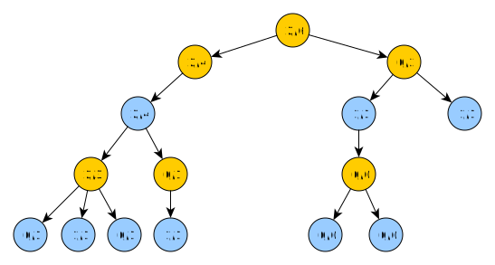

# Umìlá inteligence pro deskovou hru Warlight
## Abstrakt
Warlight, inspirovanı deskovou hrou Risk, pøedstavuje
vızvu pro tvorbu umìlé inteligence z dùvodu obrovského branching
faktoru.

Práce implementuje umìlou inteligenci do této hry schopnou hrát vyrovnanou hru
s alespoò ménì zkušenım hráèem. Souèástí je také simulátor, monost
hry proti UI i proti jinému lidskému hráèi ve formì hotseat (multiplayer hry na jednom poèítaèi).
Práce je vedena tak, aby umonila pouití tohoto frameworku pro další vıvoj a testování umìlé inteligence.

## Úvod
<!---popis kontextu, kterého se práce tıká - popis hry, souvislost s riskem--->

### Základní informace o høe
Warlight, inspirovanı deskovou hrou Risk, je hra pro více hráèù odehrávající se na
mapì rozdìlené na regiony. Ty se shlukují do super regionù (kontinentù).
Cílem je dobıt všechny regiony vlastnìné ostatními hráèi.
Na zaèátku hry si hráè volí poèáteèní regiony.
Kadé kolo si na svá území nejprve staví jednotky, poté útoèí na své sousedy.
Vıpoèet ztrát jednotek pøi útoku je urèen pravdìpodobnostmi.
Pøi stejném poètu útoèících a bránících jednotek by mìl útoèník utrpìt vyšší ztráty.

### Motivace
<!--- motivace k vytvoøení práce --->
I pøes existenci soutìe vypsané Riddles.io na tvorbu umìlé inteligence do hry Warlight
je tato oblast nepøíliš zmapovaná.
Dùvodem je nezveøejòování existujících implementací, nebo jejich malá, èi vùbec ádná dokumentace.
Neprobádanost, spolu s velkım branching faktorem hry, nás motivuje k pokusu o vytvoøení umìlé inteligence,
která bude schopná hrát vyrovnanou hru alespoò s ménì zkušenım hráèem.

### Cíl
<!--- co specifiètìji je v mé práci, trošku jak --->
Cílem práce je naimplementovat umìlou inteligenci do hry Warlight pouitím
modifikovaného paralelního algoritmu Monte Carlo tree search.
Pro snadnìjší vıvoj umìlé inteligence je dílèím cílem práce pøidat simulátor
pro pozorování her botù proti sobì a hru ve formì singleplayer nebo hotseat
multiplayer hry (více hráèù na jednom poèítaèi).

### Related works
Práce [GG Warlight Strategy Guide.pdf] a [LearningWarlightStrategy.pdf] popisují,
jakımi pravidly by se mìl lidskı hráè øídit pøi hraní Warlightu.

Práce [MHuntersWarLightStrategyGuide.pdf] obsahuje sadu rad, jak by se umìlá inteligence mìla
chovat v rùznıch herních situacích.

Práce [Parallelmcts.pdf] rozebírá pøístupy k implementaci algoritmu Monte Carlo tree search
paralelnì. Jejich efektivita je mìøena na høe Go.

### Struktura práce
- **Pravidla hry** - cílem první kapitoly je detailnì popsat ètenáøi pravidla hry
Warlight.
- **Umìlá inteligence** - ve druhé kapitole prozkoumáme umìlou inteligenci implementovanou
v této práci. Zamìøíme se na obecnì pouitı algoritmus a jeho modifikace pøizpùsobené znalostem této hry.
Nakonec rozebereme vısledky hry naší umìlé inteligence proti lidskım hráèùm i jinım AI. Zamìøíme
se na prùzkum jejich nedostatkù a problémová místa (moná má bıt ve future work??).
- **Implementace** - tøetí kapitola popisuje soubory související s prací a strukturu a vıznam hlavních
implementovanıch tøíd.
- **Závìr** - závìreèná kapitola zhodnocuje celé dílo. Nakonec uvádí moné navázání na tuto práci.

## Obsah práce
1. [Pravidla hry]
2. [Umìlá inteligence]
3. [Implementace]
4. Závìr práce
5. [Seznam pouité literatury]

## Pravidla hry
Pravidla hry Warlight jsou relativnì volná, hra se dá hrát na spoustu rùznıch nastavení.
V této kapitole si vezmeme nastavení, která jsou pouita v této práci,
a popíšeme pravidla hry.

### Mapa
Hra se odehrává na mapì. Ta se dìlí na *regiony*, nejmenší územní celky této hry.
Kadı region má armádu, seznam sousedních regionù, a buï hráèe, kterı ho vlastní, nebo je neobsazenı.
Regiony se dále shlukují do vìtších územních celkù, *super regionù*.
Mapou mùe bıt libovolnı neorientovanı graf regionù.

### Zaèátek hry
Na zaèátku hry si hráè zvolí poèáteèní regiony tak, e od kadého super regionu vezme právì jeden.
Tato zvolená území pøedstavují vıchozí body, ze kterıch bude obsazovat další.

### Prùbìh hry
- hráèi se støídají po tazích
- odehrají-li všichni hráèi své tahy, dojde k vıpoètu a následné zmìnì stavu hry
- hra konèí ve chvíli, kdy jeden hráè dobude území všech ostatních hráèù

### Tah
Tah se dìlí na 3 fáze: deploy, attack a commit. V deploy fázi hráè staví armádu,
v attack fázi posílá útoky a v commit fázi potvrzuje své pøedchozí akce.


#### Deploy
V této fázi hráè staví armádu na ním vlastnìnıch regionech.
Hráè má urèenı maximální poèet jednotek, které mùe v daném tahu postavit.
Od zaèátku hry si mùe stavìt 5 jednotek. Dobude-li nìjakı super region,
zvıší se mu pøísun jednotek o bonus definovanı super regionem.

#### Attack
V této fázi hráè útoèí jednotkami vdy ze svého regionu na region sousední,
popøípadì jednotky pøesouvá mezi svımi sousedními regiony.
Pøi útoku nelze útoèit s celou armádou. Musí na regionu zùstat alespoò jedna jednotka.

#### Commit
V této fázi hráè potvrzuje své veškeré pøedchozí akce.
Po tomto potvrzení ji není moné je vrátit a tah je povaován za uzavøenı.

### Kolo
Kadı hráè pøispívá do kola právì jedním tahem. Vıpoèet kola se spouští, jakmile všichni hráèi potvrdí
své akce commitem.

Ty se nejprve zlinearizují, poté následuje vıpoèet zmìn.

#### Linearizace


Algoritmus:
```
Linearizuj() : kolo
    tahy = { všechny t | t je odehranı tah }
    zpøeházejNáhodnì(tahy);

    // zlinearizuj deploy akce
    deploy = {}
    pro kadı index i = 1, ..., maximum(poèet deploy akcí libovolného tahu)
        iDeploy := { i-té deploy akce všech tahù }
        deploy.pøidej(iDeploy)

    // zlinearizuj attack akce
    attack = {}
    pro kadı index i = 1, ..., maximum(poèet attack akcí libovolného tahu)
        iAttack := { i-té attack akce všech tahù }
        zpøeházejNáhodnì(iAttack)
        deploy.pøidej(iAttack)

    linearizovanéKolo = (deploy, attack)
    vra linearizovanéKolo

```

#### Vıpoèet zmìn
Nejprve jsou spuštìny všechny deploy akce - dojde k pøidání jednotek na zvolené regiony.

Poté jsou spuštìny všechny attack akce. Vıpoèet ztrát jednotek v boji se øídí následujícími pravidly:
- Kadá útoèící jednotka má 60% šanci na zabití bránící jednotky.
- Kadá bránící jednotka má 70% šanci na zabití útoèící jednotky.

Algoritmus pro spoèítání zmìn zpùsobenıch útoky:
```
spoèítejAttacky(linearizovanéAttacky)
    pro kadı attack v linearizovanéAttacky
        X := attack.útoèícíRegion
        Y := attack.bránícíRegion
        útoèícíHráè := attack.útoèícíHráè;

        // útoèící region zmìnil vlastníka
        pokud X.vlastník != útoèícíHráè
            pøeskoè tento útok

        // vdy musí zbıt alespoò jedna jednotka na regionu
        reálnáÚtoèícíArmáda := minimum(attack.útoèícíArmáda, X.armáda - 1)
        bránícíArmáda := Y.armáda

        // hráè útoèí na svùj region
        pokud útoèícíHráè == Y.vlastník
            pøesuò jednotky
        jinak
            // spoèítej zabité jednotky
            zabitéÚtoèícíJednotky :=
                spoèítejZabitéÚtoèícíJednotky(reálnáÚtoèícíArmáda, bránícíArmáda)
            zabitéBránícíJednotky :=
                spoèítejzabitéBránícíJednotky(bránícíArmáda, reálnáÚtoèícíArmáda)
            
            pokud byly zabity všechny útoèící i bránící jednotky
                bránícíArmáda := 1
            jinak pokud byly zabity všechny bránící, ale útoèící ne
                Y.vlastník := útoèícíHráè
            jinak pokud pøeily i bránící i útoèící
                vra se s pøeivšími útoèícími jednotkami zpìt na X
            jinak pokud pøeily bránící
                // nic nedìlej
        
```

## Umìlá inteligence
<!--- popis kapitoly --->
V této kapitole nejprve zanalyzujeme problematiku hry a
urèíme vhodnou metodu pøístupu k implementaci AI. Následnì
ukáeme naši implementaci pouitím zvoleného algoritmu,
popíšeme naimplementovanou referenèní umìlé inteligence.
Na závìr otestujeme schopnosti AI a zanalyzujeme vısledky testování.

<!--- vymezení (moná na jiné místo?) --->
Vytvoøená umìlá inteligence je schopná hrát pouze hry 1v1.

### Analıza
<!--- na poøadí záleí --->
Hra Warlight je vıpoèetnì velmi nároèná. Tah je unikátnì
urèen mnoinou deploy a sekvencí attack akcí. Liší-li
se poøadí attack akcí, mùe to mít velkı vliv na vısledek kola.

<!--- velkı branching faktor --->
Zpùsobù, jak odehrát jeden tah, je velmi mnoho. Jednotky
lze nepøebernì zpùsoby distribuovat na vlastnìné regiony,
a ještì více zpùsoby je lze posílat na regiony sousední.

<!--- nedeterminismus útoku --->
Dalším vızvou je nedeterminismus útoku. Náhoda pøi vıpoètu
útoku mùe znatelnì ovlivnit novı stav po skonèení kola.

<!--- volba algoritmu --->
Aby algoritmus dobøe poèítal ve velkém stavovém prostoru,
mìl by bıt best-first-search. Aby uivatel neèekal pøíliš
dlouho na odpovìï AI, mìl by bıt stanovena maximální doba vıpoètu.
Algoritmus by tedy mìl bıt schopen v tento èas vydat nejlepší odpovìï,
kterou dosud našel. Z tìchto dùvodù byl pro implementaci
AI zvolen algoritmus Monte Carlo tree search.

### Monte Carlo tree search AI
V této sekci nejprve základnì popíšeme obecnì algoritmus MCTS,
následnì ukáeme jeho úpravy pro hru Warlight. Pro
zvıšení vıkonu je prozkoumán a zvolen jeden z pøístupù
k paralelizaci tohoto algoritmu.

**Terminologie**
- *náš hráè* - hráè z jeho pohledu se snaíme najít nejlepší tah
- *nepøátelskı hráè* - hráè, co není náš hráè

#### Úvod do MCTS
Monte Carlo tree search je algoritmus, jeho cílem je
najít nejlepší tah v daném stavu hry. Pro tento úèel
je stavìn vıpoèetní strom. Jeho vrcholy pøedstavují
stavy hry, hrany pøedstavují akce, které do nich vedou.
Na vrcholu je navíc uloen poèet vıher a poèet celkovıch her,
které se dotkly stavu hry v nìm uloené.
V koøeni je uloen stav hry, ze kterého se pokoušíme nalézt
nejlepší tah.
Nejlepší odpovìï reprezentuje ta hrana, která vede do vrcholu s nejvyšším poètem celkovıch her.

Algoritmus popisují 4 fáze: selekce, expanze, simulace a zpìtná propagace.
1. *Selekce* - zaèni v koøeni, v kadém potomkovi vdy zvol potomka 
podle pøedem definované funkce, dokud nedospìješ do listu
2. *Expanze* - zvolenému listu *selekcí* pøidej *n* dìtí a zvol jedno z nich
3. *Simulace* - ze zvoleného potomka zaèni náhodnì hrát, dokud jeden z hráèù neprohraje
4. *Zpìtná propagace* - propaguj informaci o vıhøe/prohøe (0/1) zpìt a do koøene.


##### Volba potomka v selekci
Funkce na volbu potomka v selekci potøebuje prozkoumávat nejen nejlepší varianty,
ale i zkoušet nové (problém *exploitation a exploration*).

[Kocsis a Csaba] navrhli funkci:

*wi / ni + c * sqrt(ln(Ni) / ni)*, kde

- wi - poèet vıher v daném vrcholu
- ni - poèet her v daném vrcholu
- Ni - celkovı poèet her (= poèet her v koøeni)
- c - konstanta, teoreticky rovná *sqrt(2)*

Pokud *ni* je rovno 0, pak hodnota tohoto vrcholu je *infinity*.
Tato situace se stane expandovaného vrcholu, ze kterého ještì nebyla vedena simulace.

#### Modifikace MCTS
Základní forma MCTS je pro Warlight stále nepouitelná.
V této sekci jsou popsány modifikace algoritmu tak,
aby efektivnì nacházel nejlepší tah v prostøedí této hry.

##### Úpravy vıpoèetního stromu
Ve høe Warlight nejprve všichni hráèi odehrají své tahy,
a poté dojde k vıpoètu kola. Jak by mìl tedy vypadat vıpoèetní strom?

<!--- vlastník vrcholu --->
Hrana bude reprezentovat tah hráèe.
U kadého vrcholu urèíme navíc jeho vlastníka. To bude
hráè, kterı odehrál tah vedoucí do tohoto vrcholu.
Vlastníkem koøene a jeho dìtí bude náš hráè.
Od následujících úrovní hloubky stromu se bude vlastnictví
vdy støídat zaèínaje od nepøítele.

<!--- stav mapy v kadém sudém vrcholu --->
Stav mapy staèí mít uloenı v koøeni a ve vrcholech vlastnìnıch nepøítelem, protoe
jeho tah je posledním tahem kola.



Na obrázku:
- lutá - hráè za kterého se pokoušíme najít nejlepší tah
- modrá - nepøátelskı hráè
- stav hry mají v sobì uloené pouze modré vrcholy a koøen

<!--- expanze vdy po dvou --->
Ve høe Warlight vdy dochází k odehrání kola a po odehrání tahù všech hráèù.
Expanze proto nejprve listu zvolenému selekcí pøidá vrcholy urèené tahy
našeho hráèe, a tìm rovnou pøidá jako potomky vrcholy urèené tahy hráèe nepøátelského.

##### Ohodnocovací funkce
Vysokı branching faktor a cyklení znemoòuje pouití náhodné simulace,
která by skonèila a ve chvíli vıhry jednoho z hráèù.
Místo toho odsimulujeme pøedem urèenı poèet tahù, ohodnotíme pozici a zpìtnou propagací vrátíme èíslo v intervalu [0, 1]
urèující kvalitu pozice.
Tuto hodnotu pak propagujeme do koøene.

Abychom mohli získat pøehled o celkové pozici, potøebujeme ohodnotit dílèí èásti.

###### Ohodnocení super regionu
Ohodnocení super regionu se liší pøi zaèátku hry, a pozdìji.

Pøi zaèátku hry, ze znalosti Warlightu, víme, e:

- je vıhodné brát super region, kterı má málo sousedících regionù,
protoe po dobytí se bude lépe bránit
- lepší je super region s více sousedními super regiony, protoe mùeme
narušovat bonusy nepøátelùm nebo rychle dobıvat další super regiony
- je lepší, kdy super region má bonus
- je nevıhodné brát super region, kterı se skládá z hodnì regionù,
protoe ho je tìké dobıt a trvá to dlouho

Tyto znalosti jsou poskládány do vzorce ohodnocovací funkce pro super region:

```
hodnota := a * bonus + b * sousední_super_regiony - c * sousední_regiony - d * regiony_super_regionu
```

kde a, b, c, d jsou reálné konstanty.

V pozdìjších fázích hry se ohodnocovací funkce liší pouze v hodnotách konstant.

###### Ohodnocení regionu
Pøi ohodnocování regionu záleí také, zdali je zaèátek hry èi ne.

Pøi zaèátku hry:

- není dobré brát více regionù blízko vedle sebe
- hodnota super regionu má vliv na hodnotu regionu
<!--- TODO --->

###### Ohodnocení pozice hráèe
Budeme ohodnocovat kadého hráèe zvláš. Pro ohodnocení hráèovy pozice
porovnáme jeho hodnotu s hodnotou druhého hráèe.

```
hodnotaHráèe(hráè)
    hodnota := 0

    pro kadı region vlastnìnı tímto hráèem
        hodnota += ohodnoceníRegionu(region)
        hodnota += ohodnoceníArmády(region.armáda)
    
    vra hodnota
```

```
ohodnoceníPoziceHráèe1(hráè1, hráè2)
    hodnotaHráèe1 := hodnotaHráèe(hráè1)
    hodnotaHráèe2 := hodnotaHráèe(hráè2)
    
    ohodnoceníPozice1 := hodnotaHráèe1 / (hodnotaHráèe1 + hodnotaHráèe2)

    vra ohodnoceníPozice1
```

##### Generátory akcí
<!--- motivace --->
Poèet monıch pokraèování v pozici je pøíliš velkı.
Algoritmus nemá dostatek èasu na procházení všech moností.
Potøebujeme nìjakım zpùsobem zmenšit stavovı prostor.

<!--- popsat, co je generátor akcí a co dìlá --->
Klíèem k tomu je generátor akcí. To je softwarová komponenta,
jejím úèelem je nalézt mnoinu smysluplnıch tahù, které
hráè mùe pouít.

<!-- popsat, jak funguje pøesnì --->
Náš akèní generátor nejprve vygeneruje monosti, jak udìlat deploy,
potom pro kadou z tìchto moností vygeneruje monosti, jak zaútoèit.

Algoritmus:
```
vygenerujTahy(stavHry) : tahy
    tahy := {}
    
    // vygeneruje monosti, jak udìlat deploy
    deploy := vygenerujDeploy(stavHry)

    pro kadou sekvenci deployAkcí z deploy
        // pøehrej deploy sekvenci akcí
        aktualizovanıStav := pøehrejDeploySekvenci(stavHry, deployAkce)
    
        // vygeneruj monosti jak zaútoèit pro danı deploy
        útoky := vygenerujMonostiÚtoku(aktualizovnıStav)

        pro kadı útok z útoky
            tahy.pøidej(deployAkce, útok)

    odstraòDuplikáty(tahy)
    vra tahy
```

###### Generování deploy akcí
Pouívá 3 pøístupy v generování deploy akcí: útoènı, obrannı a expanzivní.

1. *Útoènı* - postaví jednotky na region sousedící
s neobsazenım nebo nepøátelskım regionem,
kterı je nejcennìjší (má nejvyšší hodnotu podle ohodnocovací funkce).

2. *Obrannı* - postaví jednotky na mé nejcennìjší regiony takové,
kterım hrozí dobytí nepøítelem.

3. *Expanzivní* - postaví jednotky na region sousedící
s nejcennìjším neobsazenım regionem.

###### Generování attack akcí
<!--- záleí na poøadí --->
Pøi útoèení, narozdíl od stavìní jednotek, záleí na poøadí.
Napøíklad máme-li pozici, kde X je mùj region s armádou 8
a Y je s armádou také 8, je rozdíl, zdali X záleí první na
Y nebo naopak, protoe obránce má vıhodu.

<!--- pøesouvání jednotek z vnitrozemí k okraji --->
Jednotky, které jsou na našem regionu, kterı má
za sousedy také pouze mé regionu, jsou nevyuité.
Vyplatí se je pøesouvat k místùm, kde se budou moci
zapojit do útoku nebo obrany.

```
pøesuòArmádyZVnitrozemí(stavHry)
    pøesuny := {}
    pro kadı mùj region
        pokud všichni sousedi regionu jsou moje regiony
            // najdi nejbliší region, co není mùj
            cizíRegion := najdiCizíRegion(region)

            // najdi cestu k nìmu
            cesta := najdiNejkratšíCestuMezi(region, cizíRegion)

            // najdi první region na této cestì
            prvníRegionNaCestì := cesta[1]

            pøesun := pošliJednotky(region, prvníRegionNaCestì)

            pøesuny.pøidej(pøesun)
```

Pøi generování attack akcí pouíváme 3 moné varianty:
útoènou, útoènou s vyèkáním, obrannou.

1. *Útoèná* - z kadého regionu se vdy podíváme na
nepøátelské sousední regiony, a potom na nì zaèneme posílat
útoky, dokud naše útoèící armáda je silnìjší ne armáda bránící.

2. *Útoèná s vyèkáním* - nejprve provedeme pøesun jednotek
z vnitrozemí, poté útoèíme stejnì, jako v pøípadì útoèné varianty.

3. *Obranná* - nejprve pøesuneme jednotky, poté zaèneme posílat útoky.
Ty provádíme ale tak, e na region zaútoèíme jen s armádou, která
porazí tu nepøátelskou i v pøípadì, e by na region postavil všechny jednotky,
které mùe.

#### Paralelní MCTS

### Agresivní bot a Smart random bot

### Vısledky

## Implementace
Náplní této kapitoly je seznámit ètenáøe se soubory potøebnımi pro hru a
základními komponentami a jejich vztahy.

Projekt je implementován v jazyce C\# verze 7.2 pro .NET verze 4.5.

### Soubory
V této sekci jsou popsány soubory vytváøené nebo pøiloené k projektu a jejich vıznam.

#### Databáze
Jako databáze je v projektu pouita *SQLite*. Do ní se ukládají informace o uloenıch
hrách, simulacích a mapách. Pøedstavuje ji soubor *Utils.db*.

#### Mapy
Soubory map se nachází ve sloce *Maps*. Pro reprezentaci mapy jsou potøeba 4 soubory.
Ke høe je pøiloena mapa svìta, s podobnımi 4 soubory lze však reprezentovat libovolnou mapu.

Pøiloené soubory:
- **World.png** - obrázek mapy svìta. Je prezentován uivateli.
- **WorldTemplate.png** - obrázek mapy svìta, kde kadı region má pøiøazenou unikátní barvu.
Ta slouí pøi rozpoznávání oblasti, na kterou uivatel klikl.
- **World.xml** - obsahuje strukturu mapy svìta, popisuje super regiony a jejich bonusy,
regiony, jejich sousedy, ke kterému super regionu patøí, poèáteèní armády na regionech
- **WorldColorRegionMapping.xml** - pøiøazuje unikátní barvu kadému regionu

Šablony, podle kterıch se píší XML na definici struktury dané mapy a pøiøazování unikátní barvy regionu:
- **Map.xsd** - schéma validující XML se strukturou mapy
- **RegionColorMapping.xsd** - schéma validující XML mapování barvy na region

#### Uloené hry a simulátor
Uloené hry se nacházejí ve sloce *SavedGames*. Tato sloka má dva podadresáøe: *Hotseat* a *Singleplayer*.
Ty urèují, pro jakı typ hry dané uloené hry slouí.
Uloené hry jsou pojmenovány *{èíslo hry}.sav*, jedná se o binárnì serializovanou *Game* tøídu.

Uloenı stav v simulátoru se nachází ve sloce *Simulator*. Ten je uloen opìt pod jménem *{èíslo hry}.sav*.
Navíc je, pokud bylo v prùbìhu simulace puštìné logování, obsah logu k dané høe uloen pod jménem *{èíslo hry}.log*.
V tom je ve zjednodušené formì zapsáno, pro kadé kolo, jak AI ohodnotilo jednotlivá území, a jak vyhodnotilo
kvalitu monıch tahù.

### Architektura
Cílem této sekce je projít a popsat hlavní komponenty práce a jejich fungování.

#### Pøehled


Obrázek vıše pøedstavuje základní vztahy mezi projekty.

- *WinformsUI* - grafické komponenty zobrazované uèivateli
- *Client.Entities* - databázové entity
- *GameHandlers* - pomocné jednotky pro UI, starají se o backendovou logiku
uivatelskıch pøíkazù a o herní vıpoèty (napø. kola)
- *GameObjects* - reprezentují herní objekty (pø. region, super region, mapu, tah, ...)
- *GameAi* - tøídy slouící k vıpoètu umìlé inteligence

#### Projekt WinformsUI
Tento projekt obsahuje grafické komponenty zobrazované uivateli: formuláøe
a související user controly.
Ty jsou psány pouitím Windows Forms technologie. Dìlí se na dvì logické celky:
nastavovací a ingame komponenty.

1. *Nastavovací* - nachází se v adresáøi *GameSetup*. Umoòují uivateli nastavit
hru. Jako pomocné user controly pouívají komponenty z adresáøe *HelperControls*.
Nastavovací komponenty se starají o zaloení nové hry nebo simulace a naètení uloené hry
nebo simulace.
2. *InGame* - jsou zobrazovány uivateli po zaloení nebo naètení hry nebo simulace.

    O simulaci se stará tøída *SimulatorInGameControl*. Tato tøída je zobrazena 
    uivateli po naètení nebo vytvoøení nové simulace. Pøijímá uivatelovy akce
    a pøeposílá je dál komponentì *SimulationFlowHandler* na zpracování.

    O prùbìh hry se starají zbıvající tøídy. Tøída *InGameControl* je zobrazena
    uivateli. Ta obsahuje mapu - reprezentována tøídou *MapHandlerControl* starající
    se o uivatelskou interakci s mapou, a herní panel. Herní panel je reprezentován
    ve sloce *Phases*. Ty se starají o zvládání jednotlivıch fází tahu.

#### Projekt GameObjectLib
V této knihovnì jsou datové struktury reprezentující mapu, hráèe, hru a její záznam.


Na obrázku vıše je znázornìné zjednodušené schéma popisující objekty a jejich vztahy.

**Tøídy**

- *Map* - reprezentuje mapu hry, obsahuje informaci o všech regionech a super regionech
- *Game* - pøedstavuje hru, má mapu a seznam hráèù, co tuto hru hrají. Obsahuje také
informaci o všech dosud odehranıch kolech.
- *Player* - reprezentuje hráèe hry.
- *Turn* - tah hráèe. Obsahuje seznam útokù a deploy akcí, které hráè v daném kole odehrál.
- *Round* - kolo hry. Má seznam tahù.
- *Attack* - kdo na koho útoèil s jakım poètem jednotek. Kvùli nedeterministickému vıpoètu
obsahuje také informaci o novém stavu hry po útoku (*PostAttackMapChange*).

#### Projekt GameHandlersLib
V tomto projektu se nachází pomocné tøídy UI. Protoe tato logika je pøenosná i na jiné platformy
ne desktopové, jsou komponenty oddìleny od Winforms UI tøíd.
Tøídy tohoto projektu se dìlí na dvì skupiny: map handlery a game handlery.

##### Map handlery
Map handlery slouí k vykreslování zmìn na mapì do bitmapy. Starají se o vykreslování
poètu jednotek na regiony, pøekreslování barev regionù a zvıraznìní regionù.

**Tøídy**

- *ColoringHandler* - pøekresluje region na poadovanou barvu. Dùraz byl kladen èasovì
efektivní implementaci.
- *TextDrawingHandler* - vykresluje text na obrázek mapy. Pouívá se k vykreslení poètu jednotek na region mapy.
Algoritmus nejprve najde region, na kterı se má èíslo vypsat. Na tomto regionu pak najde unikátnì zbarvenı
pixel urèující kam napsat toto èíslo, a èíslo pak vypíše.
- *HighlightHandler* - dokáe zvıraznit region. Zvıraznìní probíhá tak, e
algoritmus vykreslí kadı 3. pixel regionu mapy na pøedem zvolenou highlight barvu. 
- *MapImageTemplateProcessor* - pøedstavuje low-level mapování mezi obrázkem a herní objektem regionu.
Umoòuje pro kadı pixel najít region, nebo oznámit, e na daném místì se region nenachází.
- *MapImageProcessor* - wrapper nad ostatními handlery, kterı zprostøedkovává volání.

##### Game handlery
Game handlery slouí k obsluze jednotlivıch èástí hry.

**Tøídy**

- *RoundHandler* - zajišuje vıpoèet zmìn pøi pøechodu
z jednoho kola do druhého
- *GameFlowHandler* - wrapper, kterı obsahuje pomocné metody,
které se mùou z uivatelského rozhraní volat.
- *ActionEnumerator* - aby šla odsimulovaná hra
pøehrávat, je potøeba zajistit pøehrávání akcí obìma smìry.
Tato komponenta umoòuje iterovat pøes akce všech odehranıch
kol obìma smìry.
- *GameRecordHandler* - vyuitím ActionEnumeratoru umoòuje
iterovat pøes odehraná herní kola nebo odehrané herní akce.
- *BotEvaluationHandler* - spouští a zastavuje vıpoèet bota pøi simulaci.
- *SimulationFlowHandler* - pomocná tøída pro UI simulátoru,
zajišuje provolávání metod do *BotEvaluationHandler*u,
*GameRecordHandleru*

#### Projekt GameAi.Data
Tento projekt obsahuje datové struktury slouící k vıpoètu bota a reprezentaci jeho tahu.
Projekt se dìlí do nìkolika adresáøù.

Adresáø *EvaluationStructures* obsahuje
struktury, které jsou potøeba pro vıpoèet. Struktury *MapMin*, *RegionMin* a *SuperRegionMin* jsou
minifikovanım ekvivalentem obdobnì pojmenovanım tøídám v knihovnì *GameObjectsLib*. Pøi jejich
implementaci byl kladen dùraz na minimální velikost. To hraje roli pøi èastém kopírování.
K zajištìní lepšího vıkonu byly místo tøíd pouity struktury. Tøída *PlayerPerspective* odpovídá
pohledu na stav hry z perspektivy jednoho urèitého hráèe.

Adresáø *GameRecording* obsahuje tøídy, které jsou zmenšenımi ekvivalenty tøíd z *GameObjectsLib*
slouící pro záznam. Tyto tøídy pak pouívá AI mimo jiné na návrat nejlepšího nalezeného tahu.

#### Projekt GameAi
V tomto projektu jsou komponenty související s implementací AI.

Dìlí se na nìkolik skupin:
- *ActionGenerators* - generátory akcí, neboli sekvencí deploy jednotek a útokù,
pro danı stav hry z perspektivy urèitého hráèe. Tyto generátory implementují interface
*IActionsGenerator*. Rozlišují se podle fáze hry:
    - *IGameBeginningActionsGenerator* - implementace generují akce pro zaèátek
    hry
    - *IGameActionsGenerator* - implementace generují akce pro ostatní fáze hry ne poèáteèní
- *StructureEvaluators* - jedná se o implementace ohodnocovacích
funkcí pro struktury hry, tedy *RegionMin*, *SuperRegionMin* a *PlayerPerspective*

## Seznam pouité literatury
[1] *Parallel Monte-Carlo Tree Search*, Guillaume M.J-B. Chaslot, Mark H.M. Winands, and H. Jaap van den Herik

